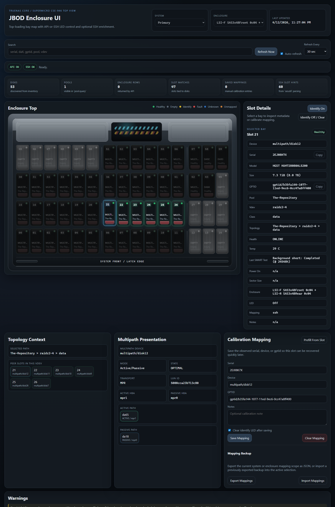

# TrueNAS JBOD Enclosure UI

## Overview

This project is a first-pass, production-usable web app for visualizing JBOD
and chassis-attached disks on TrueNAS systems without installing anything on
the storage host itself.

It runs entirely off-box in Docker, talks to TrueNAS over the middleware
websocket API, optionally enriches data over SSH, and renders a dark,
enclosure-style slot map with per-slot detail, identify LED actions where
supported, and persistent manual calibration.

The primary CORE target layout is a Supermicro CSE-946 style 60-bay top view:

- Top row: `45-59`
- Row 3: `30-44`
- Row 2: `15-29`
- Bottom row: `00-14`

The visual row layout groups each 15-bay row as `6 + 6 + 3` to better match the
physical divider layout of the chassis.

## Screenshot



## Features

- FastAPI app with server-rendered Jinja templates and light plain JavaScript
- Single-container deployment with Docker Compose
- TrueNAS API collection using websocket middleware methods:
  - `enclosure.query`
  - `enclosure.set_slot_status`
  - `disk.query`
  - `pool.query`
- `disk.details` on SCALE when available
- First-pass TrueNAS SCALE support with split front/rear enclosure pickers when
  Linux SES AES data is available over SSH
- Optional SSH enrichment for:
  - `glabel status`
  - `gmultipath list`
  - `zpool status -gP`
  - `camcontrol devlist -v`
  - `sesutil map`
  - `sesutil show`
  - `sesutil locate`
  - `sg_ses -p aes`
- 60-bay enclosure top view with color-coded slot state
- Clear selected-slot highlight for quick visual focus
- Selected-slot vdev-peer highlighting so sibling bays stand out together on the map
- Small top summary for discovered disks, pools, enclosure rows, slot matches,
  saved mappings, and SSH slot hints
- Search/filter by slot, serial, device, gptid, pool, vdev
- Manual refresh plus configurable auto-refresh intervals
- Last updated timestamp and source health strip
- Per-slot detail pane with:
  - device
  - serial
  - model
  - size
  - SMART temperature
  - last SMART test result
  - power-on age
  - logical and physical sector size
  - gptid
  - pool
  - vdev
  - vdev class
  - topology
  - health
  - multipath mode, member-path state, and HBA/controller path context when available
  - enclosure metadata
  - LED state
- Copy-to-clipboard buttons for serial and gptid
- SSH identify LED control via `sesutil locate` when the TrueNAS enclosure API
  does not expose writable enclosure rows
- Persistent JSON slot calibration storage on a bind mount
- Manual calibration workflow for imperfect slot mapping
- Graceful partial-data behavior when API or SSH is incomplete
- `/healthz` endpoint for Docker health checks

## Limitations

- The enclosure parser is intentionally defensive because `enclosure.query`
  payloads can differ between TrueNAS versions, HBAs, and SES implementations.
- The app assumes one primary enclosure at a time. There is a config filter for
  selecting the intended enclosure, but the UI is not yet multi-enclosure.
- SSH parsing for `sesutil map`, `sesutil show`, and `zpool status -gP` is
  heuristic and meant as a practical first pass, not a perfect topology engine
  for every hardware layout.
- LED control depends on either the TrueNAS enclosure API exposing a writable
  enclosure row, or SSH fallback being allowed to run `sesutil locate`.
- The default layout is the Supermicro 60-bay top view. Different chassis
  layouts will likely need config changes and possibly small template/CSS
  adjustments.

## Directory Layout

```text
truenas-jbod-ui/
|- app/
|- config/
|  |- config.example.yaml
|- data/
|  |- .gitkeep
|- docs/
|  |- SSH_READ_ONLY_SETUP.md
|  |- V0_3_SCALE_NOTES.md
|- logs/
|  |- .gitkeep
|- .dockerignore
|- .env.example
|- Dockerfile
|- docker-compose.yml
|- README.md
\- requirements.txt
```

## Setup

1. Copy the environment example:

   ```bash
   cp .env.example .env
   ```

2. Copy the sample config:

   ```bash
   cp config/config.example.yaml config/config.yaml
   ```

3. Edit `.env`:
   - set `TRUENAS_HOST`
   - set `TRUENAS_API_KEY`
   - decide whether `TRUENAS_VERIFY_SSL` should be `true` or `false`
   - enable SSH only if you want richer correlation

4. If you want SSH enrichment:
   - place your private key in `./config/ssh/id_truenas`
   - prefer a dedicated non-root account if it can run the required inventory
     commands
   - make sure the key is readable by Docker
   - consider mounting a `known_hosts` file and enabling strict host key
     checking

5. Start the app:

   ```bash
   docker compose up -d --build
   ```

6. Open the UI:

   - `http://your-docker-host:8080`

## Systemd-Free Docker Deployment

This project is meant to be run directly with Docker Compose on a separate Linux
host. No systemd unit is required.

Typical host-side layout:

```text
./config
./config/ssh
./data
./logs
```

Useful commands:

```bash
docker compose up -d --build
docker compose logs -f
docker compose ps
docker compose down
```

## Read-Only SSH Setup

A conservative SSH setup guide for live slot mapping is included here:

- [docs/SSH_READ_ONLY_SETUP.md](docs/SSH_READ_ONLY_SETUP.md)

The short version is:

- prefer a dedicated non-root account
- use SSH keys, not passwords
- leave `Permit Sudo` off at first
- start with the smallest permissions possible
- test each required command individually before deciding whether anything needs
  to be loosened
- if this hardware only blocks SES access, prefer command-limited sudo for the
  exact `sesutil` subcommands you need over root SSH or broader system changes

## Configuration

The app supports both YAML config and environment variable overrides. In
practice:

- Put stable, non-secret defaults in `config/config.yaml`
- Put secrets and environment-specific values in `.env`

### Important settings

#### TrueNAS

- `TRUENAS_HOST`
- `TRUENAS_API_KEY`
- `TRUENAS_VERIFY_SSL`
- `TRUENAS_TIMEOUT`
- `TRUENAS_ENCLOSURE_FILTER`

#### SSH

- `SSH_ENABLED`
- `SSH_HOST`
- `SSH_USER`
- `SSH_PORT`
- `SSH_KEY_PATH`
- `SSH_SUDO_PASSWORD`
- `SSH_KNOWN_HOSTS_PATH`
- `SSH_STRICT_HOST_KEY_CHECKING`

#### Layout

- `LAYOUT_SLOT_COUNT`
- `LAYOUT_ROWS`
- `LAYOUT_COLUMNS`
- `LAYOUT_API_SLOT_NUMBER_BASE`

`LAYOUT_API_SLOT_NUMBER_BASE` matters because many TrueNAS enclosure APIs use
1-based slot numbers while the UI intentionally labels slots `00-59`.

## API-Only Mode

API-only mode is the default and requires only:

- a reachable TrueNAS host
- a valid API key

In this mode the app:

- queries enclosure state
- queries disk inventory
- queries pool data
- tries to correlate slots to disks using API metadata alone

This is the cleanest setup and may be sufficient if your enclosure metadata is
already well-behaved.

## API + SSH Mode

Enable SSH mode when API-only correlation is incomplete.

The app uses SSH only as a fallback enrichment layer. It does not install
anything on TrueNAS. It runs existing native commands remotely and parses the
output.

The SSH layer helps with:

- recovering `gptid -> device` relationships from `glabel status`
- recovering multipath member-path state from `gmultipath list`
- recovering pool/vdev/class membership from `zpool status -gP`
- recovering device model hints from `camcontrol devlist -v`
- recovering physical slot layout from `sesutil map`
- recovering extra serial/model/size hints from `sesutil show`
- driving identify LEDs through `sesutil locate` when the API cannot target the
  shelf directly

For non-root accounts, the app can also handle absolute-path and `sudo -n`
command strings, for example:

```yaml
commands:
  - /sbin/glabel status
  - /usr/local/sbin/zpool status -gP
  - gmultipath list
  - sudo -n /usr/sbin/sesutil map
  - sudo -n /usr/sbin/sesutil show
  # Optional if you also enable SSH LED control:
  # - sudo -n /usr/sbin/sesutil locate -u /dev/ses4 16 on
  # - sudo -n /usr/sbin/sesutil locate -u /dev/ses4 16 off
```

If your CORE build only supports command-limited sudo with a password, the app
can also feed a sudo password non-interactively for commands that begin with
`sudo ...`. In that case:

- keep SSH login on keys
- set a strong local password on the dedicated user
- prefer disabling SSH password authentication in the TrueNAS SSH service if
  that fits your environment
- set `SSH_SUDO_PASSWORD` in `.env`

If SSH fails, the app still loads in API-only style and surfaces warnings
instead of hard-failing.

## Calibration Mode

The manual mapping layer exists because generic JBOD and SES reporting can be
imperfect even when TrueNAS itself is healthy.

### First-pass workflow

1. Select a slot in the UI.
2. Click `Identify On`.
3. Verify which physical bay lights up on the chassis.
4. Enter or confirm the observed serial, device, or gptid in the calibration
   form.
5. Save the mapping.
6. Optionally let the app clear the identify LED after saving.

Mappings are stored in:

- `/app/data/slot_mappings.json`

With the provided compose file, that becomes:

- `./data/slot_mappings.json`

You can clear a saved mapping per slot from the same detail pane.

## Slot Mapping Notes

The app tries multiple strategies, in this order:

1. Use a saved manual mapping if one exists.
2. Use explicit enclosure slot metadata from `disk.query` if present.
3. Use slot/device hints extracted from `enclosure.query`.
4. Use SSH fallback hints like `sesutil map` and `sesutil show`.
5. Mark the slot as unknown or unmapped instead of guessing silently.

Hardware-dependent logic is intentionally isolated in:

- `app/services/parsers.py`
- `app/services/inventory.py`

Those are the first files to tune if your enclosure exposes a different payload
shape or slot numbering scheme.

## Vdev and Pool Parsing

The app attempts to show:

- pool name
- vdev class
- vdev membership
- a topology label such as `The-Repository > raidz2-0 > data`

This is derived from:

- API pool/disk data where available
- `zpool status -gP` when SSH mode is enabled
- `glabel status` for gptid/device normalization

### Edge cases called out in code

- direct stripes may not have a named top-level vdev
- `replacing-*` and `spare-*` style chains are treated as topology ancestors
- GUID-only entries can appear in zpool output and may not always resolve
  cleanly
- some disks may report pool membership in API data but not expose clean vdev
  names
- API pool topology does not ship human-friendly names for every composite
  vdev, so the app synthesizes labels such as `raidz2-0`, `mirror-7`, and
  `mirror-8` to stay close to what operators expect from `zpool status`

## LED Control

Per-slot LED control prefers the TrueNAS enclosure middleware method:

- `enclosure.set_slot_status`

When that API is unavailable on a given chassis, the app can fall back to SSH:

- `sesutil locate -u /dev/sesN <element> on`
- `sesutil locate -u /dev/sesN <element> off`

Supported actions in this first pass are:

- `IDENTIFY`
- `CLEAR`

Notes:

- the app only enables SSH LED control for slots that carry SES controller and
  element metadata from `sesutil map`
- on systems like this one, `sesutil locate` is the practical path for identify
  LEDs because `enclosure.query` returns no writable rows even though the shelf
  is visible over SES
- the UI uses POST requests for LED-changing actions and surfaces errors instead
  of pretending the action succeeded

## Multipath Awareness

When SSH mode includes `gmultipath list`, the detail pane can also show a small
operator-focused presentation summary for multipath-backed disks:

- multipath device name such as `multipath/disk12`
- overall multipath mode such as `Active/Passive`
- overall geom state such as `OPTIMAL` or `DEGRADED`
- member path devices and their state such as `ACTIVE`, `PASSIVE`, or `FAIL`
- per-member controller labels such as `mpr0` and `mpr1` when SSH also includes
  `camcontrol devlist -v`

If `camcontrol` is unavailable or not permitted, the app still renders the
multipath summary and simply omits controller/HBA labels.

## Security Notes

- Do not commit `.env` with real API keys.
- Use `TRUENAS_VERIFY_SSL=false` only if you understand the risk of disabling
  TLS verification for self-signed environments.
- Mount SSH keys read-only.
- Prefer a dedicated TrueNAS API key with only the permissions you need.
- If you enable SSH, prefer a dedicated non-root operational account that can
  run the required inventory commands.
- Consider enabling `SSH_STRICT_HOST_KEY_CHECKING=true` and mounting a
  `known_hosts` file once you have the workflow validated.
- The app avoids logging secrets and only logs operational errors and warnings.

## Troubleshooting

### UI loads but every slot is unknown

- Check `docker compose logs -f`
- Verify `TRUENAS_HOST` and `TRUENAS_API_KEY`
- Confirm the Docker host can reach the TrueNAS websocket endpoint
- If your TrueNAS API uses a self-signed cert, confirm
  `TRUENAS_VERIFY_SSL=false` is set intentionally

### API works but slots do not line up with the physical chassis

- Confirm `LAYOUT_API_SLOT_NUMBER_BASE`
- Set `TRUENAS_ENCLOSURE_FILTER` if multiple enclosures are returned
- Use the calibration workflow and persist manual mappings
- If needed, tune `extract_enclosure_slot_candidates()` in
  `app/services/parsers.py`

### Pool and vdev fields are mostly blank

- Enable SSH mode
- Test `glabel status` and `zpool status -gP` manually over SSH from the Docker
  host
- Review warnings in the UI

### API works but no enclosure appears on this hardware

- This can happen on some TrueNAS CORE systems even when `disk.query` and
  `pool.query` work correctly.
- Enable SSH mode so the app can parse `sesutil map` and `sesutil show`.
- The first-pass parser prefers large populated SES groups and can combine a
  `Front` and `Rear` 30-slot pair into the 60-bay UI automatically.

### Identify LED requests fail

- Confirm the selected enclosure is the right one
- Confirm the underlying SES enclosure supports identify control through
  TrueNAS or `sesutil locate`
- If the slot is using SSH fallback, confirm the TrueNAS account is allowed to
  run the needed `sesutil locate` command
- Review app logs or the UI error text for the raw middleware or SSH error

### SSH enrichment fails

- Verify the key path inside the container matches `SSH_KEY_PATH`
- Confirm the key is mounted into `./config/ssh`
- If strict host key checking is enabled, make sure the mounted `known_hosts`
  file is correct
- Confirm the TrueNAS account can run the configured commands

## Known Caveats for Slot Mapping

- SES and enclosure metadata are not standardized enough to assume one perfect
  API shape across all CORE deployments.
- Some HBAs expose raw slot indexes that do not match the printed bay labels.
- Some disk entries may not carry slot information even when the enclosure does.
- Some pool members may show as GUIDs or transient replacement nodes during
  resilver.
- Manual calibration is expected to be part of the first deployment for many
  JBODs.
- Dual-path SAS shelves may expose the same physical slot through multiple SES
  devices; the parser tries to merge those views by enclosure ID.

## Development Notes

- The app intentionally avoids a heavy frontend framework.
- Hardware adapters are isolated behind small service classes.
- JSON file persistence is used on purpose so mappings are easy to inspect and
  back up.
- The app should remain usable when fields are missing rather than refusing to
  render.

## Future Improvements

- Enclosure profile metadata so different chassis can define bay proportions,
  row grouping, and service-area layout without hardcoding one visual shape
- Richer topology visualization for pool and vdev ancestry beyond the current
  compact sibling-awareness panel
- Expanded SMART detail when the underlying data is stable enough, such as SAS
  address, logical unit identifier, cache flags, and negotiated link rate
- More operator-focused multipath detail, especially for edge cases and future
  controller types beyond the current `mpr0` / `mpr1` presentation
- WebSocket or Server-Sent Events live updates
- Per-slot historical events and LED action audit trail
- Continued TrueNAS SCALE adapter work once Linux enclosure mapping and SES
  mapping are in place, especially LED control and richer SMART history

Current first-pass SCALE findings and hardware notes live here:

- [docs/V0_3_SCALE_NOTES.md](docs/V0_3_SCALE_NOTES.md)

## License

This project is licensed under the MIT License. See `LICENSE`.
