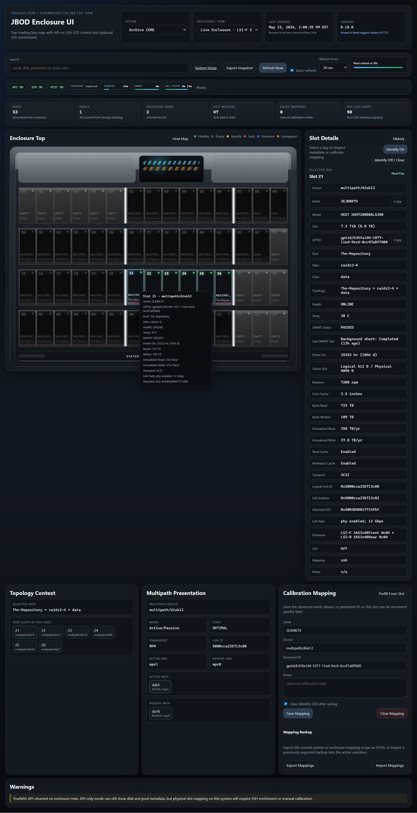
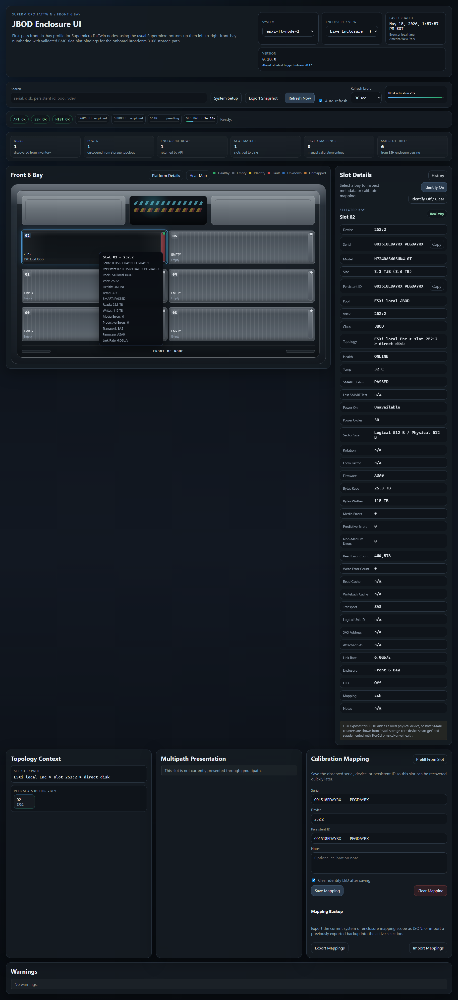

# TrueNAS JBOD Enclosure UI

Off-box enclosure and disk visualization for oddball storage hardware.

This project runs in Docker on a separate host and gives you a physical slot
view, disk detail, topology context, and LED actions where the platform can
support them. It is aimed at setups where the storage box itself does not have
good built-in chassis visibility, or where the operator needs one place to look
across multiple hosts and enclosure styles.

It does not install anything on TrueNAS CORE or SCALE. The app talks to storage
hosts over their existing API, SSH, or BMC paths and renders what it can from
there.

Public demo:

- [https://gcs8.github.io/truenas-jbod-ui/](https://gcs8.github.io/truenas-jbod-ui/)

## Screenshots

### Archive CORE



### ESXi FatTwin



### More

- Offsite SCALE: [docs/images/screenshots/scale-overview-v0.18.0.png](docs/images/screenshots/scale-overview-v0.18.0.png)
- Quantastor HA: [docs/images/screenshots/quantastor-overview-v0.18.0.png](docs/images/screenshots/quantastor-overview-v0.18.0.png)
- GPU Server Linux: [docs/images/screenshots/gpu-server-overview-v0.18.0.png](docs/images/screenshots/gpu-server-overview-v0.18.0.png)
- UniFi UNVR: [docs/images/screenshots/unvr-overview-v0.18.0.png](docs/images/screenshots/unvr-overview-v0.18.0.png)
- UniFi UNVR Pro: [docs/images/screenshots/unvr-pro-overview-v0.18.0.png](docs/images/screenshots/unvr-pro-overview-v0.18.0.png)
- History drawer: [docs/images/screenshots/history-drawer-v0.18.0.png](docs/images/screenshots/history-drawer-v0.18.0.png)
- Admin setup: [docs/images/screenshots/admin-setup-v0.18.0.png](docs/images/screenshots/admin-setup-v0.18.0.png)
- Admin ESXi host prep: [docs/images/screenshots/admin-esxi-host-prep-v0.18.0.png](docs/images/screenshots/admin-esxi-host-prep-v0.18.0.png)

## Features

- Physical slot-map UI with profile-driven chassis rendering
- Per-slot detail for serial, model, size, temperature, topology, and health
- Live enclosure switching plus saved chassis views and virtual storage views
- Manual slot calibration and persistent slot mappings
- History sidecar for slot metrics and change events
- Optional admin sidecar for setup, runtime behavior, restore, profile editing,
  and maintenance
- TrueNAS API plus SSH enrichment where that improves topology or SMART detail
- BMC-first inventory for validated Supermicro FatTwin nodes
- ESXi read-only enrichment with `esxcli` and StorCLI where available
- LED identify support where the target platform exposes a safe path
- Prometheus/OpenMetrics endpoints plus starter Grafana dashboards for
  runtime and history visibility

## Validated Platforms

- TrueNAS CORE on a Supermicro CSE-946 style `60`-bay top-loading shelf
- TrueNAS SCALE on a Supermicro `SSG-6048R-E1CR36L` with separate front `24`-bay and rear `12`-bay views
- Supermicro FatTwin `SYS-F629P3-RC1B` through the built-in `ipmi` platform with a front `6`-bay view and inferred rear `2`-bay view
- VMware ESXi `7.0.3` on that same FatTwin / Broadcom 3108 path with BMC-backed slot truth and optional StorCLI + host SMART enrichment
- VMware ESXi `7.0.3` on a Supermicro `AOC-SLG4-2H8M2` with a read-only `2`-slot M.2 carrier view
- Generic Linux on a Supermicro `SYS-2029GP-TR` with a profile-driven `2`-bay NVMe layout
- OSNexus Quantastor on a Supermicro `SSG-2028R-DE2CR24L` shared-slot HA chassis
- UniFi UNVR with a built-in `4`-bay front profile and vendor-local LED support
- UniFi UNVR Pro with a built-in `7`-bay `3-over-4` front profile and first-pass LED support

## Quick Start

### Run the published image

```bash
mkdir -p /docker-local/truenas-jbod-ui/{config/ssh,data,history/backups/long-term,logs}
cd /docker-local/truenas-jbod-ui
curl -fsSL -o compose.yaml https://raw.githubusercontent.com/gcs8/truenas-jbod-ui/main/docker-compose.yml
# create .env with your TRUENAS_HOST / TRUENAS_API_KEY first
docker compose pull
docker compose up -d
```

Optional services from the published image:

```bash
docker compose --profile history up -d
docker compose --profile admin up -d enclosure-admin
docker compose --profile history --profile admin up -d
```

For syslog, metrics, health endpoints, image updates, and Grafana dashboards,
use the operations guide:

- [Operations, Logging, and Metrics](wiki/Operations-Logging-and-Metrics.md)

Open:

- `http://your-docker-host:8080`

### Build from source

Use this only for development or branch testing.

```bash
git clone https://github.com/gcs8/truenas-jbod-ui.git
cd truenas-jbod-ui
cp .env.example .env
cp config/config.example.yaml config/config.yaml
docker compose -f docker-compose.dev.yml up -d --build
```

Optional services from source:

```bash
docker compose -f docker-compose.dev.yml --profile history up -d --build
docker compose -f docker-compose.dev.yml --profile admin up -d --build enclosure-admin
docker compose -f docker-compose.dev.yml --profile history --profile admin up -d --build
```

Open:

- `http://your-docker-host:8080`

The main UI can run by itself, but the sidecars are normal supported deploy
options, not dev-only helpers.

Ports:

- main UI: `8080`
- history sidecar: `8081`
- admin sidecar: `8082`

## Where The Detailed Docs Live

The README is intentionally short. The deeper setup and operator docs live in
the wiki:

- [Wiki Home](wiki/Home.md)
- [Quick Start](wiki/Quick-Start.md)
- [Visual Tour](wiki/Visual-Tour.md)
- [Architecture and Services](wiki/Architecture-and-Services.md)
- [Admin UI and System Setup](wiki/Admin-UI-and-System-Setup.md)
- [Backup, Restore, and Debug Bundles](wiki/Backup-Restore-and-Debug-Bundles.md)
- [Operations, Logging, and Metrics](wiki/Operations-Logging-and-Metrics.md)
- [SSH Setup and Sudo](wiki/SSH-Setup-and-Sudo.md)
- [Live Enclosures and Storage Views](wiki/Live-Enclosures-and-Storage-Views.md)
- [History and Snapshot Export](wiki/History-and-Snapshot-Export.md)
- [Demo and Offline Workflows](wiki/Demo-and-Offline-Workflows.md)
- [Public Demo Site](wiki/Public-Demo-Site.md)
- [Docker and GHCR Deployment](wiki/Docker-and-GHCR-Deployment.md)
- [Troubleshooting](wiki/Troubleshooting.md)

## Current Limits

- The shipped profiles are intentionally tied to hardware that has actually been validated
- ESXi support is read-only
- The current `ipmi` path is focused on validated Supermicro BMC behavior, not every vendor
- The richest ESXi physical-drive detail still depends on StorCLI being present on the host
- Local Windows Docker Desktop remains a weaker perf baseline than the Linux dev/test VM, especially for history/export-heavy paths

## License

MIT. See [LICENSE](LICENSE).
