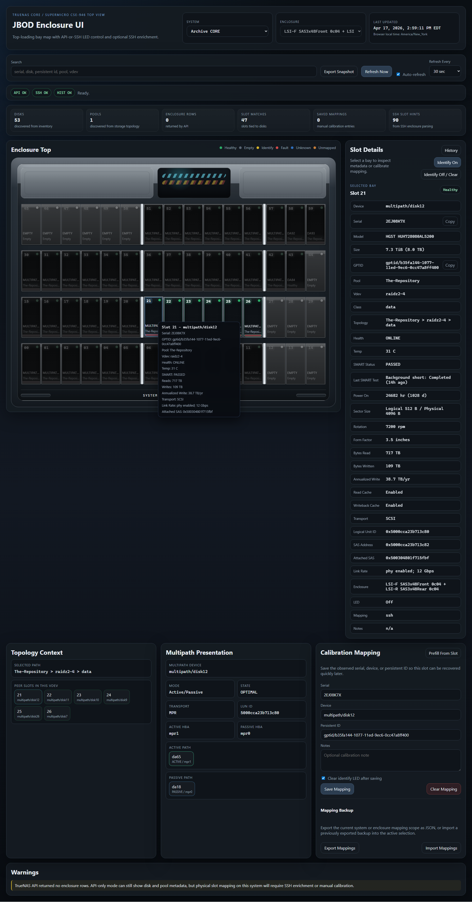
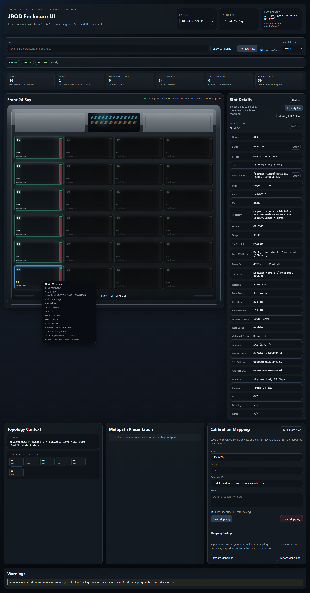

# TrueNAS JBOD Enclosure UI

## Overview

This project is a production-usable web app for visualizing JBOD and
chassis-attached disks on TrueNAS systems without installing anything on the
storage host itself. It also supports a first-pass SSH-only Linux inventory
path for profile-driven, non-TrueNAS hosts where physical disk layout still
matters, plus shipped adapters and profiles for OSNexus Quantastor shared-slot
hardware and first-pass UniFi UNVR-family appliances.

It runs entirely off-box in Docker, talks to TrueNAS over the middleware
websocket API, optionally enriches data over SSH, and renders a dark,
enclosure-style slot map with per-slot detail, identify LED actions where
supported, persistent manual calibration, and per-system / per-enclosure
selection.

The current tested hardware profiles are:

- TrueNAS CORE on a Supermicro CSE-946 style `60`-bay top-loading shelf
- TrueNAS SCALE on a Supermicro `SSG-6048R-E1CR36L` with separate front `24`-bay
  and rear `12`-bay enclosure views
- Generic Linux on a Supermicro `SYS-2029GP-TR` using a profile-driven `2`-bay
  right-side NVMe view backed by SSH `lsblk`, `mdadm`, and `nvme` discovery
- OSNexus Quantastor on a Supermicro `SSG-2028R-DE2CR24L`, modeled as a
  first-pass shared-front `24`-slot `1x24` profile with REST-first inventory,
  SSH/`qs` enrichment, SES-aware LED control, and shared-face HA context
- UniFi UNVR as a generic Linux / vendor-CLI appliance with a built-in `4`-bay
  front profile, direct ATA/SATA SMART detail, and validated vendor-local SSH
  LED control
- UniFi UNVR Pro as a generic Linux / vendor-CLI appliance with a built-in
  `7`-bay `3-over-4` front profile, direct ATA/SATA SMART detail, and
  experimental vendor-local SSH LED control

The CORE layout groups each 15-bay row as `6 + 6 + 3` to better match the
physical divider layout of the chassis. The SCALE layout uses chassis-specific
front and rear grids derived from Linux SES data and operator notes.

## Screenshots

### Archive CORE



### Offsite SCALE



### Additional Validated Platforms

- GPU Server Linux: [docs/images/screenshots/gpu-server-overview-v0.9.0.png](docs/images/screenshots/gpu-server-overview-v0.9.0.png)
- UniFi UNVR: [docs/images/screenshots/unvr-overview-v0.9.0.png](docs/images/screenshots/unvr-overview-v0.9.0.png)
- UniFi UNVR Pro: [docs/images/screenshots/unvr-pro-overview-v0.9.0.png](docs/images/screenshots/unvr-pro-overview-v0.9.0.png)
- Quantastor: [docs/images/screenshots/quantastor-overview-v0.9.0.png](docs/images/screenshots/quantastor-overview-v0.9.0.png)

### History And Snapshot Walkthroughs

- Live history drawer: [docs/images/screenshots/history-drawer-v0.9.0.png](docs/images/screenshots/history-drawer-v0.9.0.png)
- Snapshot export dialog: [docs/images/screenshots/snapshot-export-dialog-v0.9.0.png](docs/images/screenshots/snapshot-export-dialog-v0.9.0.png)
- Frozen offline snapshot: [docs/images/screenshots/offline-snapshot-v0.9.0.png](docs/images/screenshots/offline-snapshot-v0.9.0.png)

## Features

- FastAPI app with server-rendered Jinja templates and light plain JavaScript
- Single-container default deployment with an optional Docker Compose history sidecar
- When the optional history sidecar is reachable, the main UI exposes a slot-detail
  `History` view in a wide drawer under the enclosure and renders on-screen
  timestamps in the viewer's browser-local timezone
- TrueNAS API collection using websocket middleware methods:
  - `enclosure.query`
  - `enclosure.set_slot_status`
  - `disk.query`
  - `pool.query`
- `disk.details`, `disk.temperatures`, and on-demand SMART summaries on SCALE
  when available through API or SSH
- Multi-system and multi-enclosure pickers so CORE shelves and SCALE front/rear
  views can live in the same app
- Profile-driven enclosure rendering so validated hardware and custom layouts
  can share the same slot-map UI
- First-pass TrueNAS SCALE support with split front/rear enclosure pickers when
  Linux SES AES and enclosure-status data is available over SSH
- First-pass generic Linux support for SSH-only `mdadm` / NVMe hosts where no
  TrueNAS API is available
- Generic Linux support can also cover password-only appliance-style hosts
  when SSH works but the vendor API does not expose per-disk slot inventory,
  such as the shipped UniFi UNVR and first-pass UNVR Pro paths
- First-pass Quantastor support for storage-system, disk, and pool inventory on
  shared-slot hardware, with REST-first metadata plus optional SSH/`qs` CLI
  enrichment for disk and enclosure detail, and master-node / IO-fencing
  warnings
- UniFi appliance inventory through `ubntstorage disk inspect`, with built-in
  UniFi-specific tray styling and ATA/SATA SMART enrichment over SSH
- Vendor-local UniFi SSH LED control for the regular UNVR and experimental
  vendor-local UniFi SSH LED control for the UNVR Pro
- Optional SSH enrichment for:
  - `glabel status`
  - `gmultipath list`
  - `zpool status -gP`
  - `mdadm --detail --scan`
  - `nvme list-subsys -o json`
  - `nvme smart-log -o json`
  - `nvme id-ctrl -o json`
  - `nvme id-ns -o json`
  - `camcontrol devlist -v`
  - `sesutil map`
  - `sesutil show`
  - `sesutil locate`
  - `sg_ses -p aes`
  - `sg_ses -p ec`
  - `smartctl -x -j`
- Optional Quantastor SSH/`qs` CLI enrichment for `disk-list`,
  `hw-disk-list`, and `hw-enclosure-list` when the appliance API is missing
  slot/controller detail
- Chassis-specific enclosure views with color-coded slot state
- Clear selected-slot highlight for quick visual focus
- Selected-slot vdev-peer highlighting so sibling bays stand out together on the map
- Small top summary for discovered disks, pools, enclosure rows, slot matches,
  saved mappings, and SSH slot hints
- Search/filter by slot, serial, device, persistent ID, pool, vdev
- Manual refresh plus configurable auto-refresh intervals
- Last updated timestamp and source health strip
- Per-slot detail pane with:
  - device
  - serial
  - model
  - size
  - SMART temperature
  - last SMART test result
  - power-on age
  - logical and physical sector size
  - rotation rate, form factor, and read/write cache state when SMART data provides them
  - SCALE smartctl transport context such as protocol, logical unit ID, SAS address, and negotiated link rate when available
  - NVMe endurance and write-volume context such as percentage used, available spare,
    bytes read, bytes written, annualized write rate, and estimated remaining
    write endurance when SMART data provides them
  - SAS/SCSI lifetime read and write totals, plus annualized write rate, when
    `smartctl` exposes processed-byte counters through the error log
  - optional NVMe controller and namespace detail such as firmware revision,
    protocol version, warning/critical temperature thresholds, and namespace
    GUIDs when `nvme-cli` access is available over SSH
  - persistent identifier such as GPTID, PARTUUID, or WWN
  - pool
  - vdev
  - vdev class
  - topology
  - health
  - multipath mode, member-path state, and HBA/controller path context when available
  - enclosure metadata
  - LED state
- Copy-to-clipboard buttons for serial and persistent identifier
- SSH identify LED control via `sesutil locate` on CORE or `sg_ses` identify
  control on SCALE when the TrueNAS enclosure API does not expose writable
  enclosure rows
- Custom YAML-defined enclosure profiles loaded from `paths.profile_file`
  without code changes
- Persistent JSON slot calibration storage on a bind mount
- Manual calibration workflow for imperfect slot mapping
- Graceful partial-data behavior when API or SSH is incomplete
- `/healthz` endpoint for Docker health checks

## Limitations

- The enclosure parser is intentionally defensive because `enclosure.query`
  payloads can differ between TrueNAS versions, HBAs, and SES implementations.
- The UI can switch between configured systems and enclosure views, but the
  validated enclosure profiles are still intentionally narrow rather than
  claiming universal chassis support.
- SSH parsing for `sesutil map`, `sesutil show`, and `zpool status -gP` is
  heuristic and meant as a practical first pass, not a perfect topology engine
  for every hardware layout.
- LED control depends on either the TrueNAS enclosure API exposing a writable
  enclosure row, CORE SSH fallback being allowed to run `sesutil locate`, or
  SCALE SSH fallback being allowed to run `sg_ses` identify control.
- The current enclosure profiles are intentionally targeted to the hardware that
  has been validated so far: the CORE CSE-946 top-loader and the SCALE
  SSG-6048R-E1CR36L front / rear chassis views, plus a first-pass Linux NVMe
  profile for a SYS-2029GP-TR right-side dual-bay layout.
- SCALE slot mapping and LED control currently depend on Linux SES access over
  SSH because the tested SCALE host does not expose usable enclosure rows
  through the middleware API.
- Generic Linux slot mapping currently depends on explicit profile `slot_hints`
  and host inventory data such as `lsblk`, `mdadm`, and `nvme list-subsys`.
  It does not currently infer arbitrary Linux chassis geometry on its own.
- Quantastor support is still intentionally first-pass in the current release. The current
  implementation treats each storage system as a selectable system-scoped view,
  supplements the REST path with SSH/`qs` CLI disk/enclosure rows when enabled,
  and warns when HA groups are present instead of attempting full shared-face,
  active-node, or IO-fencing visualization yet.
- UniFi UNVR support is currently centered on SSH plus on-box vendor tooling,
  not on a rich documented Protect storage API.
- UniFi UNVR Pro support is still first-pass and should be treated as
  inventory/SMART-solid but LED-experimental until more bays are validated on
  real hardware.
- On the validated Quantastor cluster, the documented REST and `qs` identify
  operations are still being rejected by the LSI controller path, so the app
  now prefers SSH `sg_ses` when one of the HA nodes exposes a usable enclosure
  device. If the selected node does not expose the working SES path, add the
  peer node to `ssh.extra_hosts` so the app can fall through to it for LED
  control and live identify-state refresh.
- Write-endurance and TBW-style estimates are only shown when the underlying
  SMART data actually exposes lifetime write counters. The current NVMe path is
  good here; generic HDD/SAS write-rate coverage is still best-effort.
- Generic Linux LED control is not assumed. If the host does not expose SES
  devices such as `/dev/sg*`, the app will stay inventory-only unless there is
  a validated vendor-local control path such as the current UniFi UNVR-family
  `sata_led_sm.set_fault(...)` flow.

## Directory Layout

```text
truenas-jbod-ui/
|- app/
|- config/
|  |- config.example.yaml
|  |- profiles.example.yaml
|- data/
|  |- .gitkeep
|- docs/
|  |- PROFILE_AUTHORING.md
|  |- SSH_READ_ONLY_SETUP.md
|  |- GPU_SERVER_NOTES.md
|  |- V0_3_SCALE_NOTES.md
|- history/
|  \- .gitkeep
|- history_service/
|- logs/
|  |- .gitkeep
|- tests/
|- .dockerignore
|- .env.example
|- Dockerfile
|- docker-compose.yml
|- README.md
\- requirements.txt
```

## Setup

1. Copy the environment example:

   ```bash
   cp .env.example .env
   ```

2. Copy the sample config:

   ```bash
   cp config/config.example.yaml config/config.yaml
   ```

3. Optional if you want custom chassis layouts:

   ```bash
   cp config/profiles.example.yaml config/profiles.yaml
   ```

4. Edit `.env`:
   - set `TRUENAS_HOST`
   - for TrueNAS CORE/SCALE, set `TRUENAS_API_KEY`
   - for Quantastor, set `TRUENAS_API_USER` and `TRUENAS_API_PASSWORD`
   - leave `TRUENAS_VERIFY_SSL=true` unless you intentionally need to trust a
     self-signed or rapidly rotating lab certificate
   - enable SSH if you want the app to supplement Quantastor REST data with
     `qs` CLI disk / enclosure rows

5. If you want SSH enrichment:
   - place your private key in `./config/ssh/id_truenas`
   - prefer a dedicated non-root account if it can run the required inventory
     commands
   - make sure the key is readable by Docker
   - by default, the first successful SSH connection pins the observed host key
     into `/app/data/known_hosts`; future connections must match it unless you
     intentionally clear or edit that file

6. Start the app:

   ```bash
   docker compose up -d --build
   ```

7. Optional if you want lightweight historical slot metrics and change events:

   ```bash
   docker compose --profile history up -d --build
   ```

   The history sidecar stays separate from the main UI, stores SQLite data under
   `./history`, and binds its small status/API page to `127.0.0.1:8081` by
   default. When it is healthy, the regular UI on `:8080` will surface a
   `History` button in Slot Details, open a wide history drawer under the
   enclosure, and proxy the history API through the main app so you do not need
   a second desktop-visible port. The sidecar also keeps rotating SQLite
   snapshots under `./history/backups` by default so the history store is not
   just a single live file, and it promotes one weekly snapshot for four weeks
   plus one monthly snapshot for three months under
   `./history/backups/long-term` unless you override that path.

8. Open the UI:

   - `http://your-docker-host:8080`
   - optional direct history sidecar/API page: `http://127.0.0.1:8081`

## Systemd-Free Docker Deployment

This project is meant to be run directly with Docker Compose on a separate Linux
host. No systemd unit is required.

Typical host-side layout:

```text
./config
./config/ssh
./data
./history
./logs
```

Useful commands:

```bash
docker compose up -d --build
docker compose --profile history up -d --build
docker compose logs -f
docker compose ps
docker compose down
```

## Read-Only SSH Setup

A conservative SSH setup guide for live slot mapping is included here:

- [docs/SSH_READ_ONLY_SETUP.md](docs/SSH_READ_ONLY_SETUP.md)
- [docs/GPU_SERVER_NOTES.md](docs/GPU_SERVER_NOTES.md) for the current Ubuntu /
  `mdadm` / NVMe generic Linux test host
- [docs/UNVR_NOTES.md](docs/UNVR_NOTES.md) for the current UniFi UNVR /
  UNVR Pro generic Linux discovery notes

## GitHub Wiki Source

The repo now includes a GitHub-wiki-ready page set under:

- [`wiki/Home.md`](wiki/Home.md)
- [`wiki/Quick-Start.md`](wiki/Quick-Start.md)
- [`wiki/TrueNAS-CORE-Setup.md`](wiki/TrueNAS-CORE-Setup.md)
- [`wiki/TrueNAS-SCALE-Setup.md`](wiki/TrueNAS-SCALE-Setup.md)
- [`wiki/Quantastor-Setup.md`](wiki/Quantastor-Setup.md)
- [`wiki/Generic-Linux-Setup.md`](wiki/Generic-Linux-Setup.md)
- [`wiki/SSH-Setup-and-Sudo.md`](wiki/SSH-Setup-and-Sudo.md)
- [`wiki/History-and-Snapshot-Export.md`](wiki/History-and-Snapshot-Export.md)
- [`wiki/Profiles-and-Custom-Layouts.md`](wiki/Profiles-and-Custom-Layouts.md)
- [`wiki/Advanced-Configuration.md`](wiki/Advanced-Configuration.md)
- [`wiki/Troubleshooting.md`](wiki/Troubleshooting.md)

The idea is to keep the wiki content reviewable in the main repo, then copy or
publish those pages to the GitHub wiki repo when you want them live.

The short version is:

- prefer a dedicated non-root account
- use SSH keys, not passwords
- leave `Permit Sudo` off at first
- start with the smallest permissions possible
- test each required command individually before deciding whether anything needs
  to be loosened
- if this hardware only blocks SES access, prefer command-limited sudo for the
  exact `sesutil` subcommands you need over root SSH or broader system changes

## Configuration

The app supports both YAML config and environment variable overrides. In
practice:

- Put stable, non-secret defaults in `config/config.yaml`
- Put secrets and environment-specific values in `.env`

### Important settings

#### TrueNAS

- `TRUENAS_HOST`
- `TRUENAS_API_KEY`
- `TRUENAS_API_USER`
- `TRUENAS_API_PASSWORD`
- `TRUENAS_VERIFY_SSL`
- `TRUENAS_TIMEOUT`
- `TRUENAS_ENCLOSURE_FILTER`

TrueNAS CORE/SCALE use `TRUENAS_API_KEY`. Quantastor currently uses
`TRUENAS_API_USER` and `TRUENAS_API_PASSWORD` for basic-auth REST access and,
when SSH enrichment is enabled, for the local `qs --server=localhost,...` CLI
fallback too.

#### SSH

- `SSH_ENABLED`
- `SSH_HOST`
- `SSH_USER`
- `SSH_PORT`
- `SSH_KEY_PATH`
- `SSH_PASSWORD`
- `SSH_SUDO_PASSWORD`
- `SSH_KNOWN_HOSTS_PATH`
- `SSH_STRICT_HOST_KEY_CHECKING`

#### Layout

- `LAYOUT_SLOT_COUNT`
- `LAYOUT_ROWS`
- `LAYOUT_COLUMNS`
- `LAYOUT_API_SLOT_NUMBER_BASE`
- `PATH_PROFILE_FILE`

`LAYOUT_API_SLOT_NUMBER_BASE` matters because many TrueNAS enclosure APIs use
1-based slot numbers while the UI intentionally labels slots `00-59`.

## Enclosure Profiles

The `0.4.0` profile system moves enclosure presentation out of scattered
hardware-specific UI logic and into profile metadata.

Built-in validated profiles currently cover:

- `supermicro-cse-946-top-60`
- `supermicro-ssg-6048r-front-24`
- `supermicro-ssg-6048r-rear-12`

Built-in reusable generic families now also cover:

- `generic-front-24-1x24`
- `generic-front-12-3x4`
- `generic-top-60-4x15`
- `generic-front-60-5x12`
- `generic-front-84-6x14`
- `generic-front-102-8x14`
- `generic-front-106-8x14`

Custom profiles can be loaded from `paths.profile_file` / `PATH_PROFILE_FILE`
without code changes.

Profile docs and examples:

- [config/profiles.example.yaml](config/profiles.example.yaml)
- [docs/PROFILE_AUTHORING.md](docs/PROFILE_AUTHORING.md)

## Profile Migration Notes

The validated CORE and SCALE layouts now render through built-in enclosure
profiles instead of scattered hardcoded renderer rules.

For existing deployments:

- validated hardware keeps working through the built-in profiles
- `default_profile_id` can pin a system to a specific built-in or custom
  profile
- `enclosure_profiles` can override the profile for a specific enclosure id
- `paths.profile_file` or `PATH_PROFILE_FILE` can load custom layouts from YAML

If no explicit profile is configured, the app falls back to the validated
built-in profile when it knows the chassis, or to a conservative runtime profile
when it does not.

## API-Only Mode

API-only mode is the default and requires only:

- a reachable TrueNAS host
- a valid API key

In this mode the app:

- queries enclosure state
- queries disk inventory
- queries pool data
- tries to correlate slots to disks using API metadata alone

This is the cleanest setup and may be sufficient if your enclosure metadata is
already well-behaved.

## API + SSH Mode

Enable SSH mode when API-only correlation is incomplete.

The app uses SSH only as a fallback enrichment layer. It does not install
anything on TrueNAS. It runs existing native commands remotely and parses the
output.

The SSH layer helps with:

- recovering CORE `gptid -> device` relationships from `glabel status`
- recovering multipath member-path state from `gmultipath list`
- recovering pool/vdev/class membership from `zpool status -gP`
- recovering device model hints from `camcontrol devlist -v`
- recovering physical slot layout from `sesutil map`
- recovering extra serial/model/size hints from `sesutil show`
- driving identify LEDs through `sesutil locate` when the API cannot target the
  shelf directly

For non-root accounts, the app can also handle absolute-path and `sudo -n`
command strings, for example:

```yaml
commands:
  - /sbin/glabel status
  - /usr/local/sbin/zpool status -gP
  - gmultipath list
  - sudo -n /usr/sbin/sesutil map
  - sudo -n /usr/sbin/sesutil show
  # Optional if you also enable SSH LED control:
  # - sudo -n /usr/sbin/sesutil locate -u /dev/ses4 16 on
  # - sudo -n /usr/sbin/sesutil locate -u /dev/ses4 16 off
```

If your CORE build only supports command-limited sudo with a password, the app
can also feed a sudo password non-interactively for commands that begin with
`sudo ...`. In that case:

- keep SSH login on keys
- set a strong local password on the dedicated user
- prefer disabling SSH password authentication in the TrueNAS SSH service if
  that fits your environment
- set `SSH_SUDO_PASSWORD` in `.env`

If SSH fails, the app still loads in API-only style and surfaces warnings
instead of hard-failing.

## Calibration Mode

The manual mapping layer exists because generic JBOD and SES reporting can be
imperfect even when TrueNAS itself is healthy.

### First-pass workflow

1. Select a slot in the UI.
2. Click `Identify On`.
3. Verify which physical bay lights up on the chassis.
4. Enter or confirm the observed serial, device, or persistent identifier in the calibration
   form.
5. Save the mapping.
6. Optionally let the app clear the identify LED after saving.

Mappings are stored in:

- `/app/data/slot_mappings.json`

With the provided compose file, that becomes:

- `./data/slot_mappings.json`

You can clear a saved mapping per slot from the same detail pane.

## Slot Mapping Notes

The app tries multiple strategies, in this order:

1. Use a saved manual mapping if one exists.
2. Use explicit enclosure slot metadata from `disk.query` if present.
3. Use slot/device hints extracted from `enclosure.query`.
4. Use SSH fallback hints like `sesutil map` and `sesutil show`.
5. Mark the slot as unknown or unmapped instead of guessing silently.

Hardware-dependent logic is intentionally isolated in:

- `app/services/parsers.py`
- `app/services/inventory.py`

Those are the first files to tune if your enclosure exposes a different payload
shape or slot numbering scheme.

## Vdev and Pool Parsing

The app attempts to show:

- pool name
- vdev class
- vdev membership
- a topology label such as `The-Repository > raidz2-0 > data`

This is derived from:

- API pool/disk data where available
- `zpool status -gP` when SSH mode is enabled
- `glabel status` for CORE gptid/device normalization and persistent identifier lookups

### Edge cases called out in code

- direct stripes may not have a named top-level vdev
- `replacing-*` and `spare-*` style chains are treated as topology ancestors
- GUID-only entries can appear in zpool output and may not always resolve
  cleanly
- some disks may report pool membership in API data but not expose clean vdev
  names
- API pool topology does not ship human-friendly names for every composite
  vdev, so the app synthesizes labels such as `raidz2-0`, `mirror-7`, and
  `mirror-8` to stay close to what operators expect from `zpool status`

## LED Control

Per-slot LED control prefers the TrueNAS enclosure middleware method:

- `enclosure.set_slot_status`

When that API is unavailable on a given chassis, the app can fall back to SSH:

- `sesutil locate -u /dev/sesN <element> on`
- `sesutil locate -u /dev/sesN <element> off`
- `sg_ses --dev-slot-num=<slot> --set=ident /dev/sgN`
- `sg_ses --dev-slot-num=<slot> --clear=ident /dev/sgN`

Supported actions in this first pass are:

- `IDENTIFY`
- `CLEAR`

Notes:

- the app only enables SSH LED control for slots that carry SES controller and
  element metadata from `sesutil map` or Linux SES data from `sg_ses`
- on systems like this one, `sesutil locate` is the practical path for identify
  LEDs because `enclosure.query` returns no writable rows even though the shelf
  is visible over SES
- on the tested SCALE host, identify LEDs are driven through `sg_ses`
  `--set=ident` / `--clear=ident` after the host exposes `/usr/bin/sg_ses`
  through command-limited sudo
- on the validated Quantastor HA cluster, the documented REST and `qs`
  identify methods are still failing, but the right-hand node exposes a usable
  `sg_ses` controller path; the app can now use that through `ssh.extra_hosts`
  even while the selected app view remains on the opposite node
- the UI uses POST requests for LED-changing actions and surfaces errors instead
  of pretending the action succeeded

## Multipath Awareness

When SSH mode includes `gmultipath list`, the detail pane can also show a small
operator-focused presentation summary for multipath-backed disks:

- multipath device name such as `multipath/disk12`
- overall multipath mode such as `Active/Passive`
- overall geom state such as `OPTIMAL` or `DEGRADED`
- member path devices and their state such as `ACTIVE`, `PASSIVE`, or `FAIL`
- per-member controller labels such as `mpr0` and `mpr1` when SSH also includes
  `camcontrol devlist -v`

If `camcontrol` is unavailable or not permitted, the app still renders the
multipath summary and simply omits controller/HBA labels.

## Security Notes

- Do not commit `.env` with real API keys.
- Use `TRUENAS_VERIFY_SSL=false` only if you understand the risk of disabling
  TLS verification for self-signed environments.
- Mount SSH keys read-only.
- Prefer a dedicated TrueNAS API key with only the permissions you need.
- If you enable SSH, prefer a dedicated non-root operational account that can
  run the required inventory commands.
- `SSH_STRICT_HOST_KEY_CHECKING` is enabled by default, and the app now uses a
  trust-on-first-use flow that pins the first observed host key into
  `/app/data/known_hosts`.
- The app is still intentionally unauthenticated. Keep it on a trusted
  management LAN/VLAN, or restrict access with host firewalling or a reverse
  proxy if the network boundary is broader than that.
- The app avoids logging secrets and only logs operational errors and warnings.

## Troubleshooting

### UI loads but every slot is unknown

- Check `docker compose logs -f`
- Verify `TRUENAS_HOST` and `TRUENAS_API_KEY`
- Confirm the Docker host can reach the TrueNAS websocket endpoint
- If your TrueNAS API uses a self-signed cert, confirm
  `TRUENAS_VERIFY_SSL=false` is set intentionally

### API works but slots do not line up with the physical chassis

- Confirm `LAYOUT_API_SLOT_NUMBER_BASE`
- Set `TRUENAS_ENCLOSURE_FILTER` if multiple enclosures are returned
- Use the calibration workflow and persist manual mappings
- If needed, tune `extract_enclosure_slot_candidates()` in
  `app/services/parsers.py`

### Pool and vdev fields are mostly blank

- Enable SSH mode
- Test `glabel status` and `zpool status -gP` manually over SSH from the Docker
  host
- Review warnings in the UI

### API works but no enclosure appears on this hardware

- This can happen on some TrueNAS CORE systems even when `disk.query` and
  `pool.query` work correctly.
- Enable SSH mode so the app can parse `sesutil map` and `sesutil show`.
- The first-pass parser prefers large populated SES groups and can combine a
  `Front` and `Rear` 30-slot pair into the 60-bay UI automatically on the
  tested CORE chassis.

### Identify LED requests fail

- Confirm the selected enclosure is the right one
- Confirm the underlying SES enclosure supports identify control through
  TrueNAS or `sesutil locate`
- If the slot is using SSH fallback, confirm the TrueNAS account is allowed to
  run the needed `sesutil locate` command
- Review app logs or the UI error text for the raw middleware or SSH error

### SSH enrichment fails

- Verify the key path inside the container matches `SSH_KEY_PATH`
- Confirm the key is mounted into `./config/ssh`
- If strict host key checking is enabled, make sure the saved
  `/app/data/known_hosts` entry is correct for the target host
- Confirm the TrueNAS account can run the configured commands

## Known Caveats for Slot Mapping

- SES and enclosure metadata are not standardized enough to assume one perfect
  API shape across all CORE deployments.
- Some HBAs expose raw slot indexes that do not match the printed bay labels.
- Some disk entries may not carry slot information even when the enclosure does.
- Some pool members may show as GUIDs or transient replacement nodes during
  resilver.
- Manual calibration is expected to be part of the first deployment for many
  JBODs.
- Dual-path SAS shelves may expose the same physical slot through multiple SES
  devices; the parser tries to merge those views by enclosure ID.

## Development Notes

- The app intentionally avoids a heavy frontend framework.
- Hardware adapters are isolated behind small service classes.
- JSON file persistence is used on purpose so mappings are easy to inspect and
  back up.
- The app should remain usable when fields are missing rather than refusing to
  render.

## Optional Perf Timing

For development and regression hunting, the app can emit request and workflow
timing to the normal log output.

Useful `.env` toggles:

- `PERF_TIMING_ENABLED=true`
- `PERF_LOG_ALL_REQUESTS=true`
- `PERF_SLOW_REQUEST_MS=1000`
- `PERF_SLOW_STAGE_MS=250`
- `APP_STARTUP_WARM_CACHE_ENABLED=false`
- `APP_STARTUP_WARM_SMART_ENABLED=false`
- `APP_SMART_BATCH_MAX_CONCURRENCY=12`
- `APP_SMART_PREFETCH_STRATEGY=auto`
- `APP_SMART_PREFETCH_SINGLE_THRESHOLD=128`
- `APP_SMART_PREFETCH_CHUNK_SIZE=24`
- `APP_SMART_PREFETCH_BATCH_CONCURRENCY=2`
- `APP_EXPORT_HISTORY_CONCURRENCY=12`
- `APP_EXPORT_CACHE_TTL_SECONDS=60`
- `APP_EXPORT_CACHE_MAX_ENTRIES=8`
- `PATH_SLOT_DETAIL_CACHE_FILE=/app/data/slot_detail_cache.json`

When enabled, the app logs request ids plus timing summaries for expensive
paths such as inventory snapshot builds, SMART lookups, and enclosure snapshot
export. This is intended as an opt-in debugging aid, not as always-on
telemetry. Runtime timing entries go to the normal app log output and configured
log file path, while the harness history below is stored separately under
`data/perf/`. The HTTP responses also expose native `Server-Timing` headers
when perf timing is enabled, so browser devtools and the harness can see which
stages are dominating a slow request. The browser UI also exposes a small `UI
Timing` panel when perf timing is enabled, which measures selector change or
refresh start through inventory response, repaint, history-status refresh, SMART
prefetch settle, and final "page feels done" time inside the real page.

The SMART and export knobs above are useful when a large enclosure feels slow
to repopulate after switching systems. The defaults now bias toward faster
whole-shelf prefetch on CORE/SCALE while still keeping the fan-out tunable per
environment. `APP_SMART_PREFETCH_STRATEGY=auto` will try a single whole-shelf
SMART batch first and fall back to chunked requests if that path fails, while
`chunked` keeps the older group-based behavior and `single` forces one request.
`APP_STARTUP_WARM_CACHE_ENABLED` and `APP_STARTUP_WARM_SMART_ENABLED` let the
container walk configured systems once at startup so the first switch back to a
known shelf can reuse a warmed inventory / SMART cache instead of starting cold.

For quick branch-to-branch comparison against a running local app, use:

```bash
python scripts/run_perf_harness.py --base-url http://127.0.0.1:8080 --iterations 3 --format markdown --label baseline
```

To compare large-enclosure SMART loading strategies directly, add the same
prefetch knobs the browser uses:

```bash
python scripts/run_perf_harness.py --base-url http://127.0.0.1:8080 --smart-slot-count 24 --smart-prefetch-chunk-size 24 --smart-prefetch-batch-concurrency 2 --format markdown --label core-smart-prefetch
```

By default the harness also keeps a rolling local history under `data/perf/`:

- `data/perf/latest.json` and `data/perf/latest.md`
- `data/perf/history.csv`
- `data/perf/history.jsonl`
- timestamped `data/perf/runs/*.json` and `*.md`

Each new run automatically compares itself against the previous `latest.json`
unless you disable recording or point `--baseline` at a different JSON artifact.
When the current exported mapping bundle is empty, the harness also times an
empty-bundle import round-trip so the mutation path can be tracked without
changing real slot mappings. The JSON and Markdown artifacts now keep per-
workflow stage rollups pulled from `Server-Timing`, which makes it much easier
to spot whether a slowdown came from API fetch, SSH collection, SMART fetch,
or history/export work. Export and estimate now also share a small in-process
cache for scope history, rendered HTML, and ZIP bytes, so repeating the same
snapshot export options no longer has to reassemble the full history payload on
every request. The main UI also keeps a local `slot_detail_cache.json` file for
stable slot facts and stable SMART detail so large shelves do not have to
rediscover every slowly changing identifier before the right rail becomes
useful again. Inventory source collection is also shared per system across
enclosure/layout switches, so moving between chassis views can usually reuse
one appliance fetch instead of starting from scratch, while the selected
profile geometry itself still comes from the configured or built-in profile
definitions.

## Browser QA Smoke

There is now a lightweight Playwright smoke suite for the browser flows that
are easiest to regress without noticing:

- system switch
- enclosure switch when a system exposes multiple views
- selected-slot detail reset on scope change
- no immediate auto-refresh tick after a manual system switch
- history drawer open/load on a selected slot
- snapshot export dialog estimate rendering

Install the browser test dependency once:

```bash
npm install
npm run qa:ui:install
```

Run the app locally or through Docker Compose, then point Playwright at it:

```bash
npm run qa:ui
```

Useful environment overrides:

- `PLAYWRIGHT_BASE_URL=http://127.0.0.1:8080`

The suite is intentionally environment-aware. If the current app instance only
has one configured system or one enclosure view, the relevant switch test will
skip instead of failing. When perf timing is enabled, the suite also inspects
the in-page `UI Timing` telemetry so it can verify that a switch completed as a
`system-switch` or `enclosure-switch` run instead of accidentally tripping a
stale auto-refresh path. The export-dialog smoke test uses a mocked estimate
response so the suite validates browser wiring without turning into a slow
snapshot-size benchmark. Failures keep Playwright traces, screenshots, and
video under `test-results/` and `playwright-report/`.

## Future Improvements

- keep polishing validated chassis geometry and platform-specific tray visuals
- decide whether the next major step is broader Linux appliance support,
  richer topology visualization, or optional auth / multi-user workflows
- Richer topology visualization for pool and vdev ancestry beyond the current
  compact sibling-awareness panel
- WebSocket or Server-Sent Events live updates
- Per-slot historical events and LED action audit trail

Current planning and SCALE-specific notes live here:

- [docs/ROADMAP.md](docs/ROADMAP.md)
- [docs/V0_9_0_PLAN.md](docs/V0_9_0_PLAN.md)
- [docs/V0_3_X_PLAN.md](docs/V0_3_X_PLAN.md)
- [docs/V0_4_PROFILE_PLAN.md](docs/V0_4_PROFILE_PLAN.md)
- [docs/V0_5_QUANTASTOR_PLAN.md](docs/V0_5_QUANTASTOR_PLAN.md)
- [docs/V0_3_SCALE_NOTES.md](docs/V0_3_SCALE_NOTES.md)
- [docs/QUANTASTOR_NOTES.md](docs/QUANTASTOR_NOTES.md)
- [docs/PROFILE_AUTHORING.md](docs/PROFILE_AUTHORING.md)
- [wiki/Home.md](wiki/Home.md)

## License

This project is licensed under the MIT License. See `LICENSE`.
