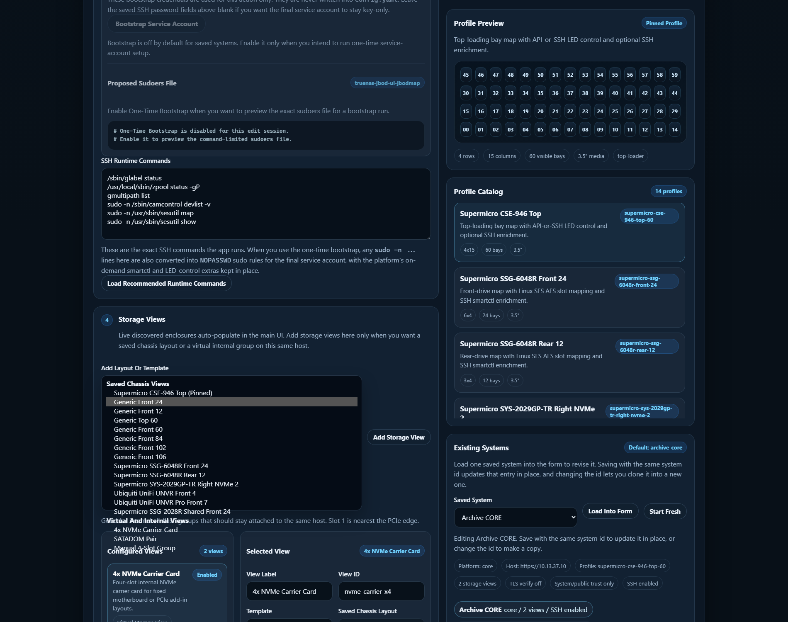

# Admin UI and System Setup

This page is the practical guide for launching and using the optional admin
sidecar.

Use it when you want:

- guided system setup
- SSH key reuse or generation
- TLS certificate inspection and trust import
- runtime restart control
- config or history backup and restore
- saved storage-view editing without changing YAML by hand

The read-only enclosure UI on `:8080` still works without this sidecar. The
admin page is optional and separate on purpose.

## How To Launch It

From the repo root, start the admin sidecar profile:

```bash
docker compose --profile admin up -d --build enclosure-admin
```

If you also want the optional history sidecar at the same time:

```bash
docker compose --profile admin --profile history up -d --build
```

Then open:

```text
http://your-docker-host:8082
```

By default the admin sidecar:

- listens on port `8082`
- auto-stops after `3600` seconds unless you change
  `ADMIN_AUTO_STOP_SECONDS`
- stays separate from the main UI so the read path can remain standalone if
  you do not want the extra write-capable maintenance surface up all the time

If the admin sidecar is reachable, the main UI on `:8080` also shows a
`System Setup` button that opens the same page in a new tab.

## What The Page Looks Like



The page is organized around one saved system at a time.

The common flow is:

1. load an existing saved system into the form, or start fresh
2. inspect or pin the profile you want
3. adjust SSH, TLS, and storage-view settings
4. save the system config
5. use runtime control or backup tools when needed

## Main Areas

### Existing Systems

Use `Load Into Form` to pull one saved system into the editor.

Use `Start Fresh` when you want to create a new system entry instead of
editing an existing one.

### Profile Catalog and Preview

The right side of the page shows:

- the currently pinned or inferred profile preview
- the loaded profile catalog

This is where you confirm the intended chassis shape before you save.

### Storage Views

The admin sidecar now uses one grouped `Add Storage View` flow.

That means:

- live discovered enclosures still auto-populate later in the main UI
- saved chassis layouts come from the profile catalog
- virtual/internal layouts still come from templates like:
  - `4x NVMe Carrier Card`
  - `SATADOM Pair`
  - other manual/internal group templates

If a live enclosure already auto-populates for the loaded system, the add list
hides the duplicate saved chassis option so the admin UI does not encourage
live-versus-saved clones.

### SSH Key and Runtime Commands

Use the SSH section when you want to:

- point at an existing key under `config/ssh`
- generate a fresh Ed25519 keypair
- review the recommended runtime command list for the target host

This is especially useful on CORE and SCALE systems where the app can stay
read-only in the main UI but still use richer SSH detail and LED control.

### TLS Trust

Use the TLS inspection area when the remote host is using a private CA or
self-signed certificate and you want verified HTTPS instead of setting
`verify_ssl: false`.

The sidecar can inspect the presented certificate chain and save trusted cert
material for later runtime use.

### Runtime Control

Use runtime control when you need to:

- restart the read UI
- restart the history sidecar
- coordinate backup or restore work with a cleaner maintenance window

The pills on the page can show whether each service is:

- normal
- needs restart
- down

## Backup and Restore

The admin sidecar is also the supported place for:

- full config export
- history DB export
- backup bundle import or restore

This keeps write-capable maintenance actions out of the normal enclosure
viewer.

## Good First-Time Pattern

For a first-time setup on a new host:

1. start the main UI and confirm basic read-only inventory works
2. start the admin sidecar on `:8082`
3. load or create the target system entry
4. configure SSH if you want richer mapping, SMART, or LED support
5. inspect TLS trust if the host uses private certs
6. add only the storage views you actually need
7. save
8. go back to the main UI and verify the new live or saved runtime targets

## Related Pages

- [[Quick Start|Quick-Start]]
- [[SSH Setup and Sudo|SSH-Setup-and-Sudo]]
- [[Live Enclosures and Storage Views|Live-Enclosures-and-Storage-Views]]
- [[History and Snapshot Export|History-and-Snapshot-Export]]
- [[Advanced Configuration|Advanced-Configuration]]
