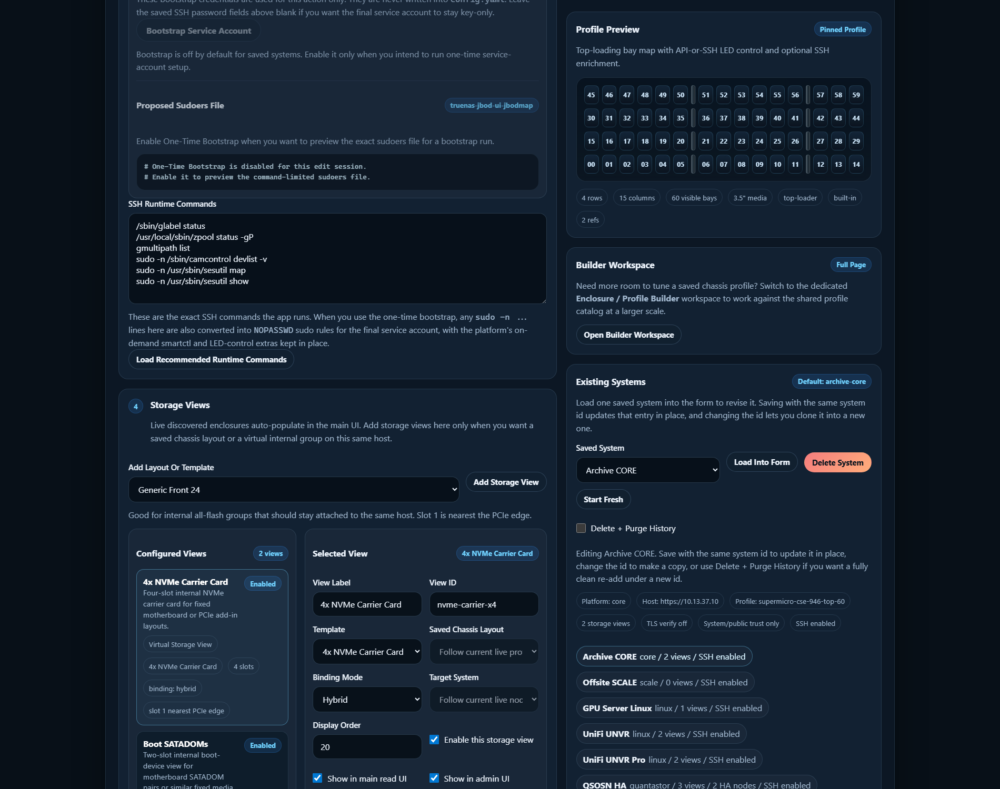
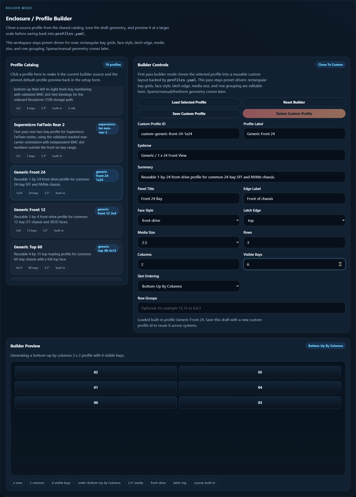
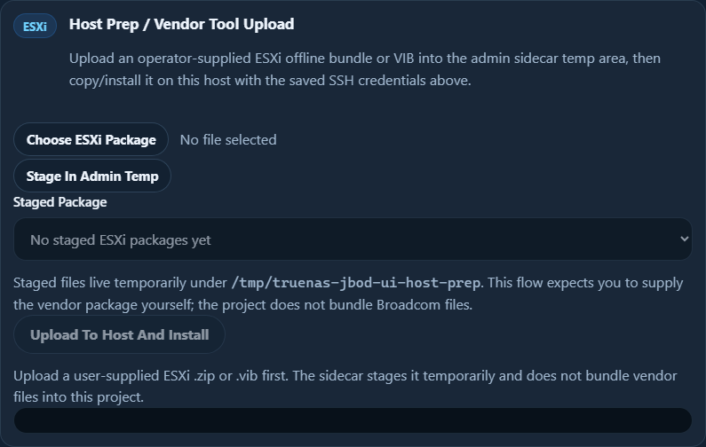
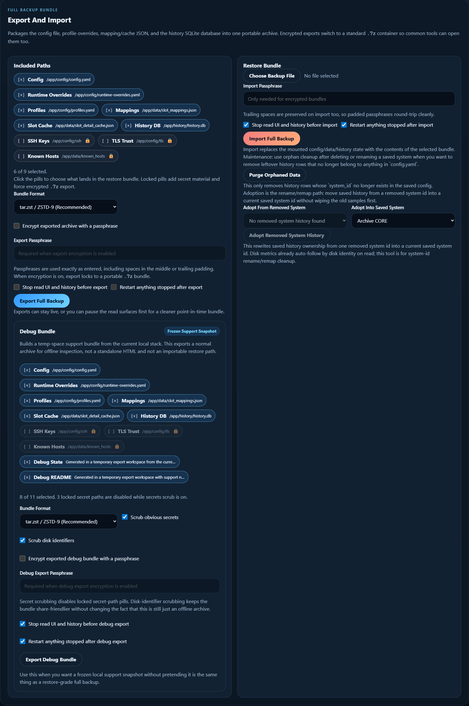

# Admin UI and System Setup

This page is the practical guide for launching and using the optional admin
sidecar.

Use it when you want:

- guided system setup
- SSH key reuse or generation
- TLS certificate inspection and trust import
- runtime restart control
- config/history restore bundles or frozen debug bundles
- one-click demo builder data for enclosure or storage-view testing
- reusable custom profile authoring through the dedicated builder workspace
- saved storage-view editing without changing YAML by hand

The read-only enclosure UI on `:8080` still works without this sidecar. The
admin page is optional and separate on purpose, but it is a normal supported
runtime service rather than a dev-only helper.

## How To Launch It

Use the same folder you created in [[Quick Start|Quick-Start]], where
`compose.yaml` and `.env` live.

If the main UI is already running and you only want to add the admin sidecar:

```bash
docker compose --profile admin pull
docker compose --profile admin up -d enclosure-admin
```

If you want the main UI and admin sidecar started together:

```bash
docker compose --profile admin pull
docker compose --profile admin up -d
```

If you also want the history sidecar at the same time from the published-image
path:

```bash
docker compose --profile admin --profile history pull
docker compose --profile admin --profile history up -d
```

Then open:

```text
http://your-docker-host:8082
```

By default the admin sidecar:

- listens on port `8082`
- auto-stops after `3600` seconds unless you change
  `ADMIN_AUTO_STOP_SECONDS`
- stays separate from the main UI so the read path can remain standalone if
  you do not want the extra write-capable maintenance surface up all the time

If the admin sidecar is reachable, the main UI on `:8080` also shows a
`System Setup` button that opens the same page in a new tab.

The top of the admin page now has two section targets:

- `Setup + Maintenance`
- `Enclosure / Profile Builder`

## What The Page Looks Like



The page is organized around one saved system at a time.

The common flow is:

1. load an existing saved system into the form, or start fresh
2. inspect or pin the profile you want
3. adjust SSH, TLS, and storage-view settings
4. save the system config
5. use runtime control or backup tools when needed

## Main Areas

### Existing Systems

Use `Load Into Form` to pull one saved system into the editor.

Use `Start Fresh` when you want to create a new system entry instead of
editing an existing one.

Use `Delete System` when you want to remove the saved config entry. Pair it
with the `Delete + Purge History` checkbox when you really want a clean break
instead of keeping the old sidecar rows around for later adoption or orphan
cleanup.

### Profile Catalog and Preview

The right side of the page shows:

- the currently pinned or inferred profile preview
- the loaded profile catalog

This is where you confirm the intended chassis shape before you save.

### Enclosure / Profile Builder

The admin sidecar now also has a dedicated builder workspace for reusable
custom chassis profiles.



Use it when you want to:

- clone a built-in profile into a custom `profiles.yaml` entry
- tweak the profile label, face style, latch edge, row groups, or bay count
- generate common row-major or column-major slot-ordering patterns
- save an explicit custom `slot_layout` without hand-editing YAML

The current builder intentionally stays preset-driven. It can save rectangular
grids, common slot-ordering presets, and explicit `Custom Matrix` layouts, but
it does not yet try to be a full drag-and-drop freeform editor.

### Storage Views

The admin sidecar now uses one grouped `Add Storage View` flow.

That means:

- live discovered enclosures still auto-populate later in the main UI
- saved chassis layouts come from the profile catalog
- virtual/internal layouts still come from templates like:
  - `4x NVMe Carrier Card`
  - `SATADOM Pair`
  - other manual/internal group templates

If a live enclosure already auto-populates for the loaded system, the add list
hides the duplicate saved chassis option so the admin UI does not encourage
live-versus-saved clones.

### SSH Key and Runtime Commands

Use the SSH section when you want to:

- point at an existing key under `config/ssh`
- generate a fresh Ed25519 keypair
- review the recommended runtime command list for the target host

This is especially useful on CORE and SCALE systems where the app can stay
read-only in the main UI but still use richer SSH detail and LED control.

For VMware ESXi, the admin sidecar now keeps the setup intentionally narrower:

- the recommended saved SSH user stays `root`
- `Password Only / No Key` is a first-class option when the host is using
  direct root password auth instead of a mounted key
- the path stays read-only and SSH-only
- the Linux one-time bootstrap and sudoers preview flow stay disabled because
  ESXi is not using Linux sudo

### ESXi Host Prep / Vendor Tool Upload

The setup form now also includes an ESXi-only `Host Prep / Vendor Tool Upload`
panel for operator-supplied vendor packages.



Use it when the host needs something like Broadcom StorCLI before the main UI
can enrich controller-backed disks properly.

The current workflow is intentionally conservative:

- choose a `.zip` offline bundle or `.vib` from your machine
- stage it in the admin sidecar temp area under
  `/tmp/truenas-jbod-ui-host-prep`
- reuse the current saved ESXi SSH host, user, and password-or-key settings
  from the form
- upload it to the host and run the matching `esxcli software component apply`
  or `esxcli software vib install` command
- get back a short verification summary instead of only a blind success/fail

Important guardrails:

- the project does **not** bundle Broadcom or other vendor binaries
- the temp area is just staging space, not long-term package management
- this path is for one-time host prep / remediation, not ongoing RAID control
- if a host only needs BMC-backed inventory, you can still use the `ipmi`
  platform and skip ESXi SSH entirely

### TLS Trust

Use the TLS inspection area when the remote host is using a private CA or
self-signed certificate and you want verified HTTPS instead of setting
`verify_ssl: false`.

The sidecar can inspect the presented certificate chain and save trusted cert
material for later runtime use.

### Runtime Control

Use runtime control when you need to:

- restart the read UI
- restart the history sidecar
- coordinate backup or restore work with a cleaner maintenance window
- confirm whether UI, history, and admin are all running the same app version

The pills on the page can show whether each service is:

- normal
- needs restart
- down

Each runtime card also shows the live running app version it probed from that
container plus the latest tagged stable release, so you can spot a stale or
partially updated sidecar without jumping across three separate pages.

### Runtime Behavior

The admin sidecar also exposes the supported runtime behavior knobs for cache
and refresh timing.

Fields owned by `.env` stay read-only and show their source. Fields owned by
admin runtime overrides are editable and save to
`config/runtime-overrides.yaml`. After saving those values, restart the read UI
from the runtime cards so the main surface picks up the new timing behavior.

## Backup, Restore, Debug, And Demo Data

The setup page exposes these tools, but the detailed guidance now lives on
separate pages so the setup walkthrough stays readable:

- [[Backup, Restore, and Debug Bundles|Backup-Restore-and-Debug-Bundles]]
  explains full backups, encrypted secret-material exports, debug bundles, and
  safe restore patterns.
- [[Demo and Offline Workflows|Demo-and-Offline-Workflows]] explains how the
  local `Add Demo Builder System` seed differs from offline snapshots, debug
  bundles, full backups, and the planned public demo site.

The short rule: use the admin sidecar for real local maintenance, but keep
demo/offline artifacts visibly separate from restore-grade backup bundles.

## History Maintenance And Recovery

The same backup/restore area now also holds the safe cleanup tools for saved
history:



Use that panel when you need to:

- purge orphaned history after deleting or renaming a saved system
- adopt removed-system history into a new saved `system_id`
- export a bundle before destructive cleanup

The detailed operator guidance lives on:

- [[History Maintenance and Recovery|History-Maintenance-and-Recovery]]

## Good First-Time Pattern

For a first-time setup on a new host:

1. start the main UI and confirm basic read-only inventory works
2. start the admin sidecar on `:8082`
3. load or create the target system entry
4. configure SSH if you want richer mapping, SMART, or LED support
5. for ESXi, use `Host Prep / Vendor Tool Upload` only if the validated read
   path still needs a vendor package such as StorCLI
6. inspect TLS trust if the host uses private certs
7. add only the storage views you actually need
8. save
9. go back to the main UI and verify the new live or saved runtime targets

If you also need a custom chassis profile, do that in the builder workspace
after the basic system entry is saved, then come back to the setup view and
attach the new profile-backed saved chassis layout there.

## Advanced Source Builds

Most users should use the published-image commands above. Use the source-build
commands only when you are editing the app, testing an unmerged branch, or
intentionally rebuilding the image on that machine.

From a cloned repo:

```bash
docker compose -f docker-compose.dev.yml --profile admin up -d --build enclosure-admin
```

With history too:

```bash
docker compose -f docker-compose.dev.yml --profile admin --profile history up -d --build
```

## Related Pages

- [[Quick Start|Quick-Start]]
- [[SSH Setup and Sudo|SSH-Setup-and-Sudo]]
- [[Live Enclosures and Storage Views|Live-Enclosures-and-Storage-Views]]
- [[History and Snapshot Export|History-and-Snapshot-Export]]
- [[Backup, Restore, and Debug Bundles|Backup-Restore-and-Debug-Bundles]]
- [[Demo and Offline Workflows|Demo-and-Offline-Workflows]]
- [[Public Demo Site|Public-Demo-Site]]
- [[Advanced Configuration|Advanced-Configuration]]
