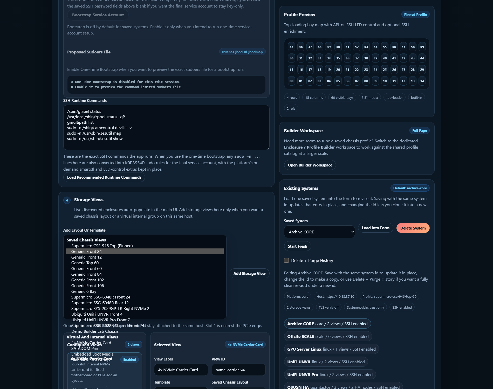
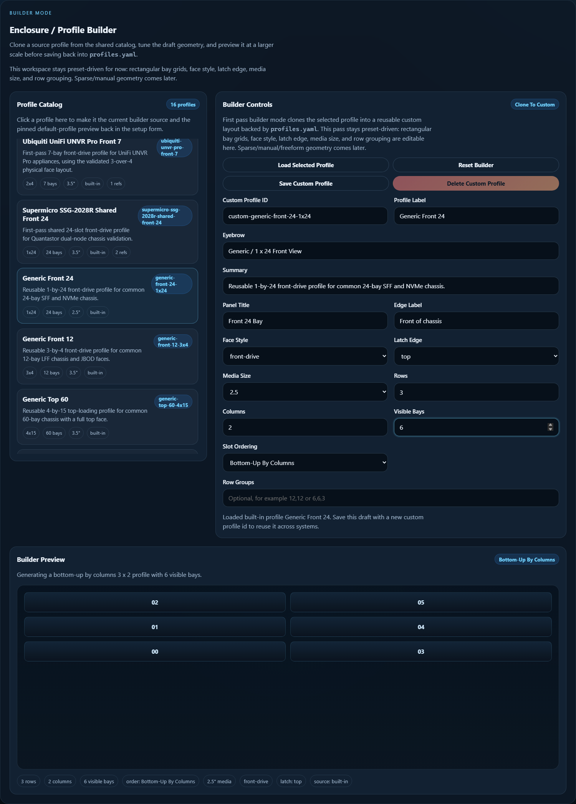
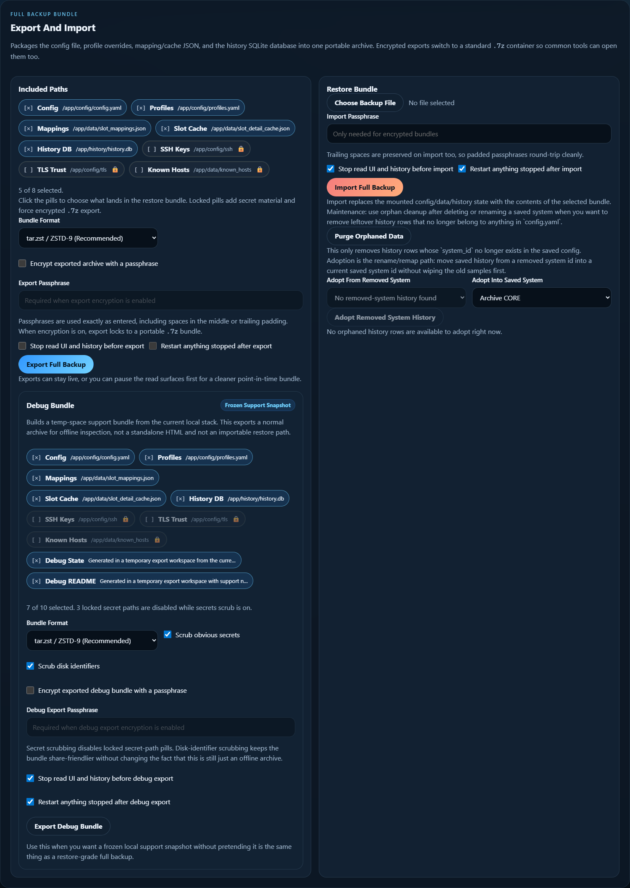

# Admin UI and System Setup

This page is the practical guide for launching and using the optional admin
sidecar.

Use it when you want:

- guided system setup
- SSH key reuse or generation
- TLS certificate inspection and trust import
- runtime restart control
- config/history restore bundles or frozen debug bundles
- one-click demo builder data for enclosure or storage-view testing
- reusable custom profile authoring through the dedicated builder workspace
- saved storage-view editing without changing YAML by hand

The read-only enclosure UI on `:8080` still works without this sidecar. The
admin page is optional and separate on purpose.

## How To Launch It

From the repo root, start the admin sidecar profile:

```bash
docker compose --profile admin up -d --build enclosure-admin
```

If you also want the optional history sidecar at the same time:

```bash
docker compose --profile admin --profile history up -d --build
```

Then open:

```text
http://your-docker-host:8082
```

By default the admin sidecar:

- listens on port `8082`
- auto-stops after `3600` seconds unless you change
  `ADMIN_AUTO_STOP_SECONDS`
- stays separate from the main UI so the read path can remain standalone if
  you do not want the extra write-capable maintenance surface up all the time

If the admin sidecar is reachable, the main UI on `:8080` also shows a
`System Setup` button that opens the same page in a new tab.

The top of the admin page now has two section targets:

- `Setup + Maintenance`
- `Enclosure / Profile Builder`

## What The Page Looks Like



The page is organized around one saved system at a time.

The common flow is:

1. load an existing saved system into the form, or start fresh
2. inspect or pin the profile you want
3. adjust SSH, TLS, and storage-view settings
4. save the system config
5. use runtime control or backup tools when needed

## Main Areas

### Existing Systems

Use `Load Into Form` to pull one saved system into the editor.

Use `Start Fresh` when you want to create a new system entry instead of
editing an existing one.

Use `Delete System` when you want to remove the saved config entry. Pair it
with the `Delete + Purge History` checkbox when you really want a clean break
instead of keeping the old sidecar rows around for later adoption or orphan
cleanup.

### Profile Catalog and Preview

The right side of the page shows:

- the currently pinned or inferred profile preview
- the loaded profile catalog

This is where you confirm the intended chassis shape before you save.

### Enclosure / Profile Builder

The admin sidecar now also has a dedicated builder workspace for reusable
custom chassis profiles.



Use it when you want to:

- clone a built-in profile into a custom `profiles.yaml` entry
- tweak the profile label, face style, latch edge, row groups, or bay count
- generate common row-major or column-major slot-ordering patterns
- save an explicit custom `slot_layout` without hand-editing YAML

The current builder intentionally stays preset-driven. It can save rectangular
grids, common slot-ordering presets, and explicit `Custom Matrix` layouts, but
it does not yet try to be a full drag-and-drop freeform editor.

### Storage Views

The admin sidecar now uses one grouped `Add Storage View` flow.

That means:

- live discovered enclosures still auto-populate later in the main UI
- saved chassis layouts come from the profile catalog
- virtual/internal layouts still come from templates like:
  - `4x NVMe Carrier Card`
  - `SATADOM Pair`
  - other manual/internal group templates

If a live enclosure already auto-populates for the loaded system, the add list
hides the duplicate saved chassis option so the admin UI does not encourage
live-versus-saved clones.

### SSH Key and Runtime Commands

Use the SSH section when you want to:

- point at an existing key under `config/ssh`
- generate a fresh Ed25519 keypair
- review the recommended runtime command list for the target host

This is especially useful on CORE and SCALE systems where the app can stay
read-only in the main UI but still use richer SSH detail and LED control.

### TLS Trust

Use the TLS inspection area when the remote host is using a private CA or
self-signed certificate and you want verified HTTPS instead of setting
`verify_ssl: false`.

The sidecar can inspect the presented certificate chain and save trusted cert
material for later runtime use.

### Runtime Control

Use runtime control when you need to:

- restart the read UI
- restart the history sidecar
- coordinate backup or restore work with a cleaner maintenance window

The pills on the page can show whether each service is:

- normal
- needs restart
- down

## Backup and Restore

The admin sidecar is also the supported place for:

- restore-grade full backup export
- full backup bundle import or restore
- frozen debug bundle export for support review

This keeps write-capable maintenance actions out of the normal enclosure
viewer.

### Full Backup Bundles

The `Included Paths` pills are now selectable instead of just descriptive.

Use the default plaintext scope when you only need the core app state:

- `config/config.yaml`
- `config/profiles.yaml`
- slot mappings and slot-detail cache JSON
- the history SQLite database

The locked pills are the secret-material path:

- `config/ssh`
- imported TLS trust bundles
- shared `known_hosts`

Selecting any locked pill forces encrypted portable `.7z` export. That keeps
secret material out of plaintext bundles while still letting the admin import
path restore those same selected files later.

### Debug Bundles

The `Debug Bundle` card is a different tool from the restore bundle.

Use it when you want a frozen support snapshot of the local stack for offline
inspection. It:

- exports a normal archive, not a self-contained HTML file
- is not an importable restore path
- can stop/restart the UI and history sidecar around capture
- has separate `Scrub obvious secrets` and `Scrub disk identifiers` toggles

If `Scrub obvious secrets` stays on, the locked secret-path pills remain
disabled in the debug bundle so private keys and trust material do not
accidentally ride along.

### Demo Builder Seed

The setup form now also exposes `Add Demo Builder System`.

Use it when you want a safe local fixture for custom enclosure/profile work
without pointing at a real host first. The action seeds:

- a synthetic `demo-builder-lab` system
- a matching custom demo chassis profile
- sample saved/virtual storage views for builder and layout checks

After saving a new system into the mounted config, restart the read UI so the
runtime selector picks the updated system list up cleanly.

## History Maintenance And Recovery

The same backup/restore area now also holds the safe cleanup tools for saved
history:



Use that panel when you need to:

- purge orphaned history after deleting or renaming a saved system
- adopt removed-system history into a new saved `system_id`
- export a bundle before destructive cleanup

The detailed operator guidance lives on:

- [[History Maintenance and Recovery|History-Maintenance-and-Recovery]]

## Good First-Time Pattern

For a first-time setup on a new host:

1. start the main UI and confirm basic read-only inventory works
2. start the admin sidecar on `:8082`
3. load or create the target system entry
4. configure SSH if you want richer mapping, SMART, or LED support
5. inspect TLS trust if the host uses private certs
6. add only the storage views you actually need
7. save
8. go back to the main UI and verify the new live or saved runtime targets

If you also need a custom chassis profile, do that in the builder workspace
after the basic system entry is saved, then come back to the setup view and
attach the new profile-backed saved chassis layout there.

## Related Pages

- [[Quick Start|Quick-Start]]
- [[SSH Setup and Sudo|SSH-Setup-and-Sudo]]
- [[Live Enclosures and Storage Views|Live-Enclosures-and-Storage-Views]]
- [[History and Snapshot Export|History-and-Snapshot-Export]]
- [[Advanced Configuration|Advanced-Configuration]]
