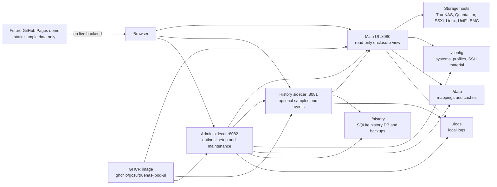

# Architecture and Services

This page explains what runs where.

The short version:

- the main UI is the read path on `:8080`
- the history sidecar is optional and collects sampled slot data on `:8081`
- the admin sidecar is optional and owns setup, runtime control, backup, and
  maintenance workflows on `:8082`
- all three services use the same published image when you deploy from GHCR
- the app talks to your storage hosts from your Docker machine, not from
  GitHub Pages or a hosted cloud backend

## Service Map

## Services At A Glance

| Service | Default port | Required? | Main job | Typical command |
| --- | ---: | --- | --- | --- |
| Main UI | `8080` | yes | physical enclosure view, slot details, safe read path | `docker compose up -d` |
| History sidecar | `8081` | no | slot metric samples, slot events, snapshot history payloads | `docker compose --profile history up -d` |
| Admin sidecar | `8082` | no | setup, SSH material, runtime controls, backups, maintenance | `docker compose --profile admin up -d enclosure-admin` |

The main UI is designed to remain useful when the history and admin sidecars
are stopped. History-backed features degrade visibly instead of breaking the
base enclosure view.

## Local Folders

Keep these beside the checkout or deployment bundle:

| Path | Purpose |
| --- | --- |
| `./config` | saved systems, profiles, runtime overrides, optional SSH material |
| `./config/ssh` | SSH keys if you let the app manage or reuse them |
| `./data` | slot mappings, detail cache, known host records |
| `./history` | history sidecar SQLite DB and backups |
| `./logs` | local app logs when configured |

The published image does not remove the need for local config and persistent
data. It only removes the need to build the container image yourself.

## Live Host Access

Depending on platform and configuration, the app can use:

- TrueNAS middleware websocket API
- Quantastor REST API
- SSH commands for richer inventory and SMART detail
- `sg_ses` or platform-local tools where supported
- BMC/IPMI paths for validated Supermicro inventory

The app does not install packages on TrueNAS CORE or SCALE. For ESXi or other
hosts, any host-prep package staging is an explicit admin action.

## Public Demo Boundary

A future GitHub Pages demo belongs outside this live service map.

It should load scrubbed or synthetic sample data directly in the browser. It
must not connect to your storage hosts, run the FastAPI backend, hold secrets,
or expose admin maintenance actions.

See [[Public Demo Site|Public-Demo-Site]] and
[[Demo and Offline Workflows|Demo-and-Offline-Workflows]].

## Related Pages

- [[Quick Start|Quick-Start]]
- [[Docker and GHCR Deployment|Docker-and-GHCR-Deployment]]
- [[Operations, Logging, and Metrics|Operations-Logging-and-Metrics]]
- [[Admin UI and System Setup|Admin-UI-and-System-Setup]]
- [[History and Snapshot Export|History-and-Snapshot-Export]]
