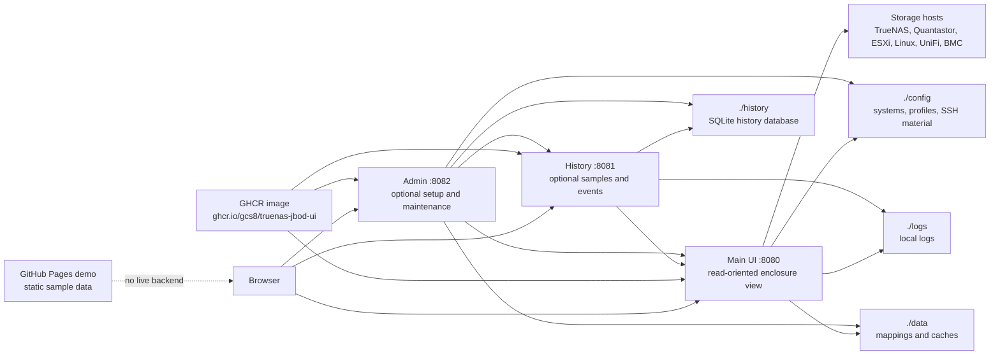

# Architecture and services

The app runs on your Docker host and connects from there to each storage host.
It has one required service and two optional sidecars.

## Service map

```mermaid
flowchart LR
    Browser["Browser"]
    UI["Main UI :8080\nread-oriented enclosure view"]
    History["History :8081\noptional samples and events"]
    Admin["Admin :8082\noptional setup and maintenance"]
    Config["./config\nsystems, profiles, SSH material"]
    Data["./data\nmappings and caches"]
    HistDB["./history\nSQLite history database"]
    Logs["./logs\nlocal logs"]
    Hosts["Storage hosts\nTrueNAS, Quantastor, ESXi, Linux, UniFi, BMC"]
    GHCR["GHCR image\nghcr.io/gcs8/truenas-jbod-ui"]
    Pages["GitHub Pages demo\nstatic sample data"]

    Browser --> UI
    Browser --> History
    Browser --> Admin
    GHCR --> UI
    GHCR --> History
    GHCR --> Admin
    UI --> Hosts
    History --> UI
    Admin --> UI
    Admin --> History
    UI --> Config
    UI --> Data
    History --> HistDB
    Admin --> Config
    Admin --> Data
    Admin --> HistDB
    UI --> Logs
    History --> Logs

    Pages -. no live backend .-> Browser
```

## Services

| Service | Port | Required | Purpose | Start command |
| --- | ---: | --- | --- | --- |
| Main UI | `8080` | yes | enclosure view, slot details, and host inventory | `docker compose up -d` |
| History | `8081` | no | metric samples, events, and snapshot history | `docker compose --profile history up -d` |
| Admin | `8082` | no | setup, runtime controls, profiles, backups, and maintenance | `docker compose --profile admin up -d enclosure-admin` |

The main UI works without either sidecar. When history is stopped, the UI marks
history-backed features unavailable instead of hiding the base enclosure view.

All three services use the same published image. You still need local persistent
folders for configuration and data.

## Persistent folders

| Path | Contents |
| --- | --- |
| `./config` | systems, profiles, runtime overrides, and optional SSH material |
| `./config/ssh` | SSH keys mounted into the containers |
| `./config/backup-secrets` | passphrase files for the one-shot backup service |
| `./data` | slot mappings, detail cache, and known host records |
| `./history` | the history SQLite database and history backups |
| `./backups` | scheduled backup archives |
| `./backup-status` | shared read-only scheduled backup status |
| `./logs` | application logs when file logging is configured |

Protect these folders as local application data. The default has no application
login. Anyone who can reach an enabled service can use the controls available
there. Restrict port access to authorized users, or enable Basic authentication
or an authenticated reverse proxy before widening access.

## Host connections

The configured platform determines which connections the app uses:

- TrueNAS middleware websocket API
- Quantastor REST API
- SSH for optional inventory, SMART, SES, and topology detail
- BMC/IPMI for supported inventory and identify paths

The app does not install packages on TrueNAS or Quantastor. Any host preparation
is a separate operator action.

## Public demo

The GitHub Pages demo loads synthetic data in the browser. It has no FastAPI
backend, credentials, live host access, or admin actions. See
[[Public Demo Site|Public-Demo-Site]].

## Related pages

- [[Quick Start|Quick-Start]]
- [[Docker and GHCR Deployment|Docker-and-GHCR-Deployment]]
- [[Admin UI and System Setup|Admin-UI-and-System-Setup]]
- [[History and Snapshot Export|History-and-Snapshot-Export]]
- [[Operations, Logging, and Metrics|Operations-Logging-and-Metrics]]
