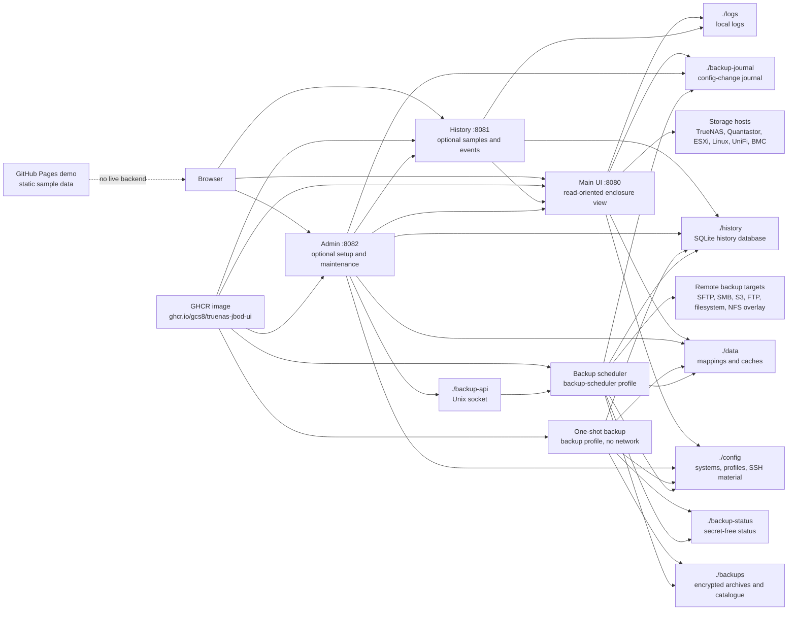

# Architecture and services

The app runs on your Docker host and connects from there to each storage host.
It has one required HTTP service, two optional HTTP sidecars, and two opt-in
backup workers.

## Service map

```mermaid
flowchart LR
    Browser["Browser"]
    UI["Main UI :8080\nread-oriented enclosure view"]
    History["History :8081\noptional samples and events"]
    Admin["Admin :8082\noptional setup and maintenance"]
    Backup["One-shot backup\nbackup profile, no network"]
    Scheduler["Backup scheduler\nbackup-scheduler profile"]
    Socket["./backup-api\nUnix socket"]
    Config["./config\nsystems, profiles, SSH material"]
    Data["./data\nmappings and caches"]
    HistDB["./history\nSQLite history database"]
    Archives["./backups\nencrypted archives and catalogue"]
    Journal["./backup-journal\nconfig-change journal"]
    Status["./backup-status\nsecret-free status"]
    Logs["./logs\nlocal logs"]
    Hosts["Storage hosts\nTrueNAS, Quantastor, ESXi, Linux, UniFi, BMC"]
    Targets["Remote backup targets\nSFTP, SMB, S3, FTP, filesystem, NFS overlay"]
    GHCR["GHCR image\nghcr.io/gcs8/truenas-jbod-ui"]
    Pages["GitHub Pages demo\nstatic sample data"]

    Browser --> UI
    Browser --> History
    Browser --> Admin
    GHCR --> UI
    GHCR --> History
    GHCR --> Admin
    GHCR --> Backup
    GHCR --> Scheduler
    UI --> Hosts
    History --> UI
    Admin --> UI
    Admin --> History
    Admin --> Socket
    Socket --> Scheduler
    UI --> Config
    UI --> Data
    UI --> Journal
    History --> HistDB
    Admin --> Config
    Admin --> Data
    Admin --> HistDB
    Admin --> Journal
    UI --> Logs
    History --> Logs
    Backup --> Config
    Backup --> Data
    Backup --> HistDB
    Backup --> Archives
    Backup --> Status
    Scheduler --> Config
    Scheduler --> Data
    Scheduler --> HistDB
    Scheduler --> Archives
    Scheduler --> Journal
    Scheduler --> Status
    Scheduler --> Targets

    Pages -. no live backend .-> Browser
```

## Services

| Service | Port / interface | Required | Purpose | Network and start boundary |
| --- | --- | --- | --- | --- |
| Main UI | `8080` | yes | enclosure view, slot details, and host inventory | ordinary Compose network; `docker compose up -d` |
| History | `8081` | no | metric samples, events, and snapshot history | ordinary Compose network; `docker compose --profile history up -d` |
| Admin | `8082` | no | setup, runtime controls, profiles, backups, and maintenance | ordinary Compose network plus Docker socket; `docker compose --profile admin up -d enclosure-admin` |
| One-shot backup | no port | no | one encrypted backup for a host timer | `backup` profile, `network_mode: none`, no Docker socket; `docker compose --profile backup run --rm enclosure-backup` |
| Backup scheduler | Unix socket only | no | config-on-change and cron backups, remote copies, retention | `backup-scheduler` profile, outbound network for remote targets, no published TCP port or Docker socket; `docker compose --profile backup-scheduler up -d enclosure-backup-scheduler` |

The main UI works without either HTTP sidecar. When history is stopped, the UI
marks history-backed features unavailable instead of hiding the base enclosure
view. The backup workers are dormant unless an operator selects their profiles;
the scheduler also keeps both backup classes off until policy enables one.

All services use the same published image. You still need local persistent
folders for configuration and data.

> **Backup scheduler: current-source checkout only.** The scheduler command
> above needs the source checkout's `docker-compose.yml` (add
> `-f docker-compose.yml` if a `compose.yaml` is also present). The beginner
> install's `compose.yaml` is the v0.22.2 base file, which has no scheduler
> service, and an image-only update cannot add one. See
> [[Backup, Restore and Debug Bundles|Backup-Restore-and-Debug-Bundles#automatic-backup-archive-and-remote-targets]].

## Persistent folders

| Path | Contents |
| --- | --- |
| `./config` | systems, profiles, runtime overrides, and optional SSH material |
| `./config/ssh` | SSH keys mounted into the containers |
| `./config/backup-secrets` | passphrase files for the one-shot backup service |
| `./data` | slot mappings, detail cache, and known host records |
| `./history` | the history SQLite database and history backups |
| `./backups` | one-shot and scheduler encrypted archives plus the scheduler catalogue |
| `./backup-status` | shared read-only, secret-free backup health status |
| `./backup-journal` | configuration-change records shared by UI, admin, and scheduler |
| `./backup-api` | private scheduler Unix socket shared only with admin |
| `./logs` | application logs when file logging is configured |

Protect these folders as local application data. The default has no application
login. Anyone who can reach an enabled service can use the controls available
there. Restrict port access to authorized users, or enable Basic authentication
or an authenticated reverse proxy before widening access.

## Backup worker trust boundaries

The one-shot `backup` worker is deliberately isolated: it has no network, no
published port, and no Docker socket. It reads `./config` and `./data`, snapshots
`./history`, and writes its archive and secret-free status mounts. `./history`
is mounted read-write, and its default history backup folder is
`./history/backups`. A host
timer starts a fresh container for each run.

The long-running `backup-scheduler` worker has outbound network access because
configured SFTP, SMB, S3, FTP, and NFS targets need it. It has no published TCP
port and no Docker socket. Admin reaches it only through the Unix socket under
`./backup-api`; the UI, admin, and scheduler share config-change records under
`./backup-journal`. The scheduler writes its encrypted archives and private
catalogue under `./backups` and exposes only secret-free health under
`./backup-status`. The optional NFS overlay grants `SYS_ADMIN` and disables the
default AppArmor profile for the scheduler alone; use it only for configured NFS
targets.

## Host connections

The configured platform determines which connections the app uses:

- TrueNAS middleware websocket API
- Quantastor REST API
- SSH for optional inventory, SMART, SES, and topology detail
- BMC/IPMI for supported inventory and identify paths

The app does not install packages on TrueNAS or Quantastor. Any host preparation
is a separate operator action.

## Public demo

The GitHub Pages demo loads synthetic data in the browser. It has no FastAPI
backend, credentials, live host access, or admin actions. See
[[Public Demo Site|Public-Demo-Site]].

## Related pages

- [[Quick Start|Quick-Start]]
- [[Docker and GHCR Deployment|Docker-and-GHCR-Deployment]]
- [[Admin UI and System Setup|Admin-UI-and-System-Setup]]
- [[History and Snapshot Export|History-and-Snapshot-Export]]
- [[Operations, Logging, and Metrics|Operations-Logging-and-Metrics]]
