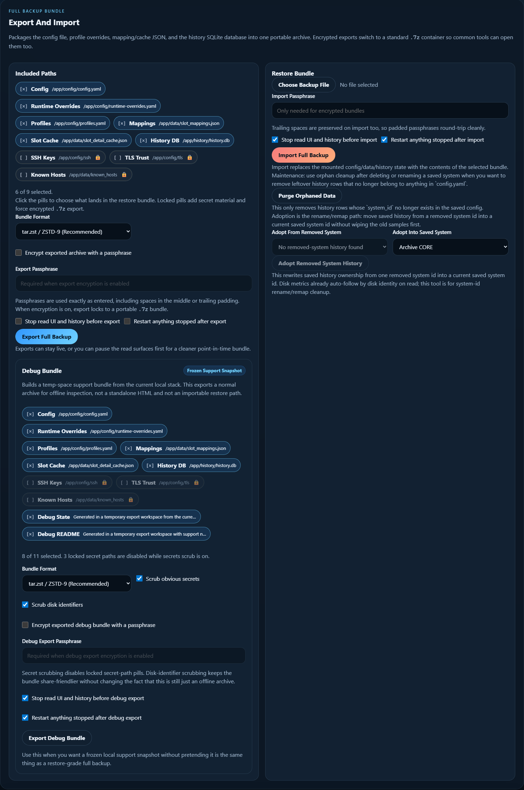

# Backup, Restore, and Debug Bundles

This page explains the export and recovery tools that live in the optional
admin sidecar.

The short version:

- use `Full Backup` when you may need to restore or move the local app state
- use `Debug Bundle` when you want a support artifact for inspection
- use `Export Snapshot` when you want one offline HTML enclosure view
- use history purge/adopt tools only after exporting anything you might care
  about later

Open the admin sidecar on `:8082` for these workflows.



## Tool Picker

| Tool | Output | Importable? | Best for |
| --- | --- | --- | --- |
| `Full Backup` | restore-grade archive | yes | migration, disaster recovery, release-candidate restore drills |
| `Debug Bundle` | support archive | no | sharing scrubbed config/history/log evidence for review |
| `Export Snapshot` | self-contained HTML file | no | sharing the current enclosure view offline |
| `Purge Orphaned Data` | maintenance action | not an export | cleaning deleted/renamed system history |
| `Adopt Removed System History` | maintenance action | not an export | rehoming old history into a current saved system id |

## Full Backup Bundles

Use a full backup when you may want to restore the app state later.

The default plaintext scope covers core state:

- `config/config.yaml`
- `config/profiles.yaml`
- slot mappings and slot-detail cache JSON
- the history SQLite database

The secret-material paths are locked because they can contain credentials or
trust roots:

- `config/ssh`
- imported TLS trust bundles
- shared `known_hosts`

Selecting any locked path forces encrypted portable `.7z` export. That keeps
secret material out of plaintext bundles while still letting the admin import
path restore those same selected files later.

The admin service supplies the 7z passphrase through a private, bounded terminal
prompt. It does not place the passphrase in the 7z process arguments or command
output. Passphrases may include spaces, including trailing spaces, but cannot
contain carriage returns or line feeds because the 7z prompt is line-oriented.

## Optional scheduled state backups

Scheduled backups use a separate one-shot container. The container has no
published port, network, or Docker socket. A host timer starts it, so the
privileged admin sidecar keeps its default one-hour auto-stop boundary.
New scheduled archives use encrypted portable `.7z` and file-backed validation,
including segmented history. Existing `.tar.zst.enc` scheduled archives remain
recognized for retention and bounded compatibility restore.

Create a private passphrase file under `config/backup-secrets` and make it
readable only by its owner. The Compose files mount that directory read-only at
`/run/backup-secrets`. Do not put the passphrase in `.env`, a command, or a unit
file.

```bash
BACKUP_UID=$(id -u)
BACKUP_GID=$(id -g)
install -d -m 0700 config/backup-secrets backups backups/scheduled backup-status
install -m 0600 /dev/null config/backup-secrets/scheduled-backup-passphrase
read -rsp 'Scheduled backup passphrase: ' BACKUP_PASSPHRASE
printf '%s' "$BACKUP_PASSPHRASE" > config/backup-secrets/scheduled-backup-passphrase
unset BACKUP_PASSPHRASE
```

Set the complete one-shot runner configuration in the ignored local `.env`:

```dotenv
BACKUP_UID=1000
BACKUP_GID=1000
SCHEDULED_BACKUP_ENABLED=true
SCHEDULED_BACKUP_DIR=/app/backups/scheduled
SCHEDULED_BACKUP_STATUS_FILE=/app/backup-status/scheduled-backup.json
SCHEDULED_BACKUP_RETENTION_COUNT=14
SCHEDULED_BACKUP_INCLUDED_GROUPS_JSON=["config_file","runtime_overrides_file","profile_file","mapping_file","sas_fabric_alias_file","slot_detail_file","history_db"]
SCHEDULED_BACKUP_PASSPHRASE_FILE=/run/backup-secrets/scheduled-backup-passphrase
HISTORY_SEGMENTED_BACKUP_MAX_AGE_SECONDS=129600
```

Replace `1000` with the numeric values printed by `id -u` and `id -g` above.
The Compose service runs as that host identity so it can traverse the `0700`
directories, read the `0600` passphrase, and write backup and status files
without running as root.

Run one backup manually before enabling a timer:

```bash
docker compose --profile backup run --rm enclosure-backup
```

The runner creates private `0600` files in the destination, verifies the copied
archive through the normal restore preflight, publishes without overwriting an
existing name, and prunes only files matching its owned filename contract. It
publishes `.tar.zst.enc` bundles. The inner archive is the validated system
backup format. The outer envelope uses AES-256-GCM with a per-file salt and
nonce. Import the file through the normal admin restore path and supply the same
passphrase.

The repository includes `deploy/systemd/truenas-jbod-system-backup.service` and
`.timer`. They assume the Compose project is installed at
`/opt/truenas-jbod-ui`; adjust `WorkingDirectory`, `ConditionPathExists`, and
`ReadWritePaths` together if it lives elsewhere. Install and enable them only
after the manual run and restore test succeed:

```bash
sudo install -m 0644 deploy/systemd/truenas-jbod-system-backup.service /etc/systemd/system/
sudo install -m 0644 deploy/systemd/truenas-jbod-system-backup.timer /etc/systemd/system/
sudo systemctl daemon-reload
sudo systemctl enable --now truenas-jbod-system-backup.timer
systemctl list-timers truenas-jbod-system-backup.timer
```

The main UI metrics endpoint reads the secret-free durable status file and
exposes run counts, last success, last failure, age, size, and failure state.
Metric labels never contain the destination, artifact name, group names, error
text, or passphrase-file path.

Hot-only history has its own single-SQLite snapshot schedule. Segmented history
does not use that snapshot because it cannot represent the catalog and immutable
segments. Its hot-data retention remains blocked until the status file records a
recent successful encrypted FULL backup that includes `history_db`. The default
maximum age is 129600 seconds, or 36 hours, which allows the daily timer and its
random delay to complete. Missing, stale, failed, or history-excluding status
fails closed without pruning hot rows.

The one-shot container mounts the whole history directory writable. Do not
file-bind only `history.db`; segmented locking rejects database-file mount
points. Size the backup destination and temporary workspace for the hot database
plus every active segment.

Hot-only deployments export backup schema 1. A deployment configured with
`HISTORY_SEGMENT_CATALOG_PATH` exports schema 2. Schema 2 includes the hot
database, every immutable segment, and the complete generation catalog. Import
validates every member and stages the hot file and segment directory as one
rollback-capable transaction.

Each immutable segment is limited to 1.5 GiB. The current query path selects at
most 32 segments and returns at most 5,000 rows. A broad request fails instead of
returning partial history. FULL backup and restore must have temporary-disk and
archive headroom for the hot file plus all selected segments. Each 7z create,
verify, list, or extract operation remains bounded to 10 minutes. Archive
creation uses normal compression with one worker thread.

The native scheduled `.tar.zst.enc` path supports schema 2 and uses the same
staged restore contract. Schema 2 restore requires the target to configure
`HISTORY_SEGMENT_CATALOG_PATH`.

See [Segmented history v2](../docs/SEGMENTED_HISTORY_V2.md) for migration,
recovery, rollback, catalog, and release-gate details.

## Restore Pattern

For real migrations:

1. export a full backup from the source stack
2. start the target Docker stack with separate local folders
3. import the bundle through the admin sidecar
4. restart the main UI and sidecars
5. verify `/livez`, the runtime selector, one live enclosure, and one history
   drawer or history dashboard view

For release-candidate or destructive testing, use a disposable QA stack with
separate ports and separate runtime folders. Do not run import, restore, purge,
adopt, delete, or runtime override tests against the long-running production
stack unless you explicitly intend to change it.

## Debug Bundles

The `Debug Bundle` card is different from full backup.

Use it when you want a frozen support snapshot of local state for offline
inspection. It:

- exports a normal archive, not a self-contained HTML viewer
- is not an importable restore path
- can stop/restart the UI and history sidecar around capture
- has separate `Scrub obvious secrets` and `Scrub disk identifiers` toggles

If `Scrub obvious secrets` stays on, the locked secret-path pills remain
disabled so private keys and trust material do not accidentally ride along.

## Snapshot Export Is Separate

`Export Snapshot` in the main UI creates a single self-contained HTML artifact
for the current enclosure or storage view.

That is useful when you want someone to inspect a physical slot map without
connecting to the live app. It is not a restore path and does not carry the full
local stack state.

See [[History and Snapshot Export|History-and-Snapshot-Export]].

## History Cleanup Safety

Before deleting or adopting history rows:

1. export a full backup if the rows may matter later
2. confirm the target saved system id
3. use preview or low-risk cleanup paths first when available
4. verify the history drawer or history dashboard afterward

The history-specific cleanup guide lives at
[[History Maintenance and Recovery|History-Maintenance-and-Recovery]].

## Related Pages

- [[Admin UI and System Setup|Admin-UI-and-System-Setup]]
- [[History Maintenance and Recovery|History-Maintenance-and-Recovery]]
- [[Demo and Offline Workflows|Demo-and-Offline-Workflows]]
- [[History and Snapshot Export|History-and-Snapshot-Export]]
- [[Architecture and Services|Architecture-and-Services]]
