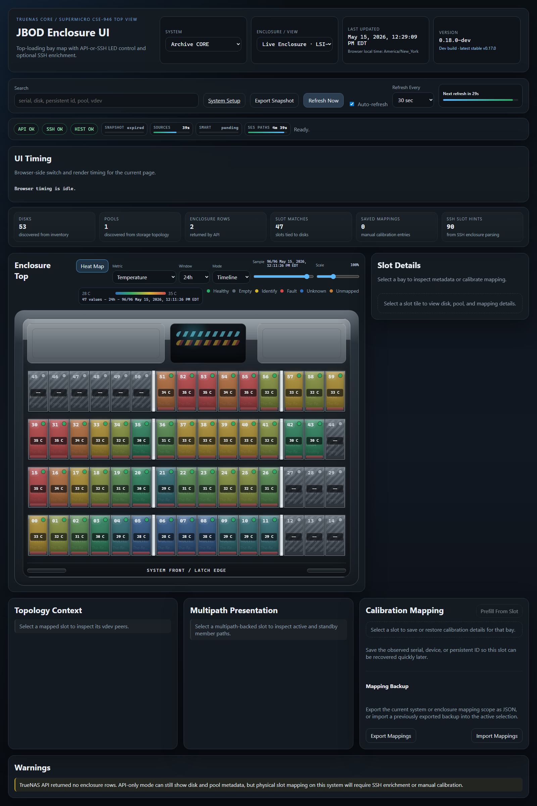

# Heat Map Mode

Heat map mode is a read-only visual layer for the main enclosure UI.

It keeps the normal physical bay layout and colors each tray by an
operator-selected metric, so you can answer the practical question:

> Where is the weirdness physically?

It does not add disk-control, LED, or admin write behavior.

## When To Use It

Use heat map mode when you want to compare slots at a glance:

- which bays are running warmer than the rest of the view
- which disks are reading or writing the most in a selected time window
- which slots have the highest read/write imbalance
- which disks have the most power-on hours, lifetime writes, or SMART error
  counters
- which occupied slots deserve attention according to the explainable
  `Attention Score`

Identity fields such as serial, GPTID, make, model, pool, vdev, firmware, and
device name stay in the normal hover/detail surfaces. Heat map mode focuses on
numeric values that can be compared across the current physical view.

## Basic Controls

In the main UI:

1. Choose the system and enclosure or storage view you want to inspect.
2. Click `Heat Map` in the enclosure header.
3. Choose a `Metric`.
4. Use `Scale` to adjust color sensitivity without changing the displayed
   values.

The heat overlay sits on the same tray shape as the enclosure renderer. The
selected metric value appears in the middle of each bay, while the normal
health, empty, identify, fault, and unknown indicators remain visible.

Empty bays and missing values render as neutral or hatched. They do not count
as zero and do not affect the heat-map scale.

## Metrics

The first pass includes:

- `Attention Score`
- `Temperature`
- `Temperature vs View Avg`
- `Power-On Hours`
- `Lifetime Read`
- `Lifetime Write`
- `Read Rate`
- `Write Rate`
- `Annualized Read`
- `Annualized Write`
- `Read/Write Ratio`
- `Endurance Used`
- `Endurance Remaining`
- `Estimated TBW Left`
- `Media Errors`
- `Predictive Errors`
- `Interface CRC Errors`
- `Unsafe Shutdowns`

`Attention Score` is an explainable heuristic, not AI or machine learning. It
adds points for concrete conditions such as SMART health problems, high
temperature, endurance risk, error counters, missing SMART on occupied slots,
and unhealthy slot state. Hover a bay to see the short reasons behind the
score.

## History-Backed Metrics

Some metrics use the optional history sidecar:

- read rate
- write rate
- Annualized Read
- Annualized Write
- Read/Write Ratio
- timeline playback for sampled metrics such as temperature

For read/write rate, the UI asks the history sidecar only for the needed raw
counter metric and disables slot events for that request. That keeps the heat
map request bounded to the visible bays instead of pulling a full history
bundle for every slot.

If the history sidecar is unavailable, the main UI keeps working and the
heat-map legend shows `History unavailable` for history-backed metrics.

## Time Windows

For history-backed metrics, use `Window` to pick the trailing range you want to
inspect.

Examples:

- use a short window such as `1h` or `24h` to spot recent activity
- use `7d` or `30d` to smooth out short bursts
- use `All` when you want the broadest view of available sidecar data

The window affects the samples used for rates and timeline playback. It does
not change lifetime SMART values that are already current-point totals.

## Timeline Scrubbing

For metrics with history samples, switch `Mode` from `Current` to `Timeline`.

Timeline mode keeps the physical enclosure view and shows one historical sample
at a time:

- it starts on the newest available sample in the selected window
- dragging the sample slider moves backward or forward through recorded samples
- after clicking the slider, use the left and right arrow keys for fine
  one-sample steps
- missing samples stay neutral instead of becoming fake zeroes

This is most useful for temperature and `Temperature vs View Avg`, but any
metric with a history-sidecar sample source can opt into timeline playback.

## Scale

The `Scale` slider changes color sensitivity for the current heat map.

It does not change the metric values. It only changes how aggressively the
visible value range maps into the blue/green/yellow/red color ramp.

Use it when the default color spread is too flat or too dramatic for the
current view.

## Current Limits

Heat map mode is intentionally a first pass:

- preferences are not persisted yet
- exported offline snapshots do not preserve the selected heat-map mode yet
- hourly/daily/weekly rollup tables are deferred until real usage shows the
  metric-only history reads are not enough
- future scale modes may add absolute thresholds, historical baselines,
  neighbor comparisons, or row-aware deviation metrics

For history sidecar setup, storage, and snapshot export behavior, see
[[History and Snapshot Export|History-and-Snapshot-Export]].
