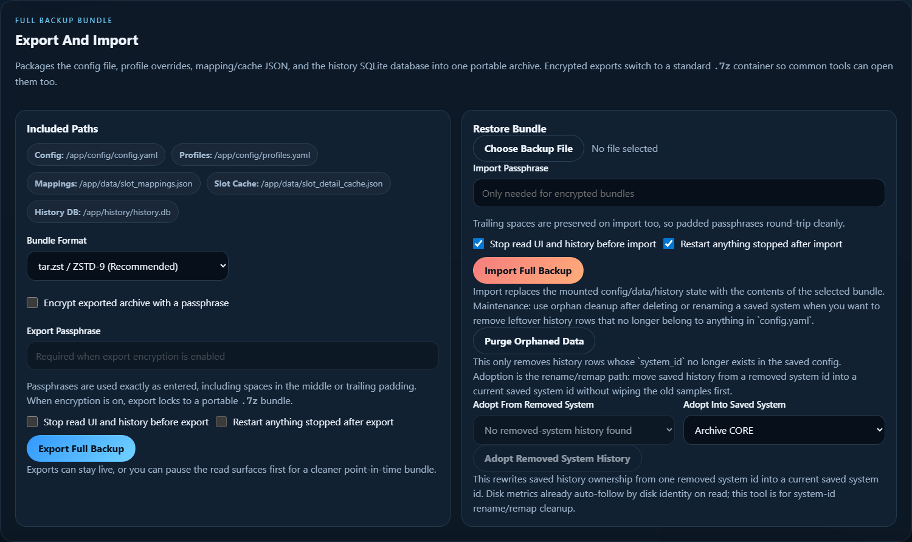

# History Maintenance and Recovery

This page is the operator guide for cleaning up saved history when a system is
deleted, renamed, or rebuilt under a new `system_id`.

The admin maintenance area now exposes the safe paths directly:

## Export First If The History Matters

Before a destructive cleanup, export a full backup bundle from the same admin
panel.

That gives you:

- the saved config
- profile overrides
- mapping and cache JSON
- the history SQLite DB

If you are not sure whether to purge or adopt, export first.

## Delete System Vs Delete + Purge History

The `Existing Systems` panel gives you two different delete behaviors:

- `Delete System`
  - removes the saved config entry only
  - leaves the history DB rows in place
  - useful when you plan to re-add the system with the same id or adopt the
    old rows later
- `Delete + Purge History`
  - removes the saved config entry
  - deletes matching history rows for that `system_id`
  - useful when you really want a clean start

If you delete a system and then recreate it with the same `system_id`, its old
history will still line up naturally. If you recreate it under a new
`system_id`, you either need adoption or orphan cleanup.

## Purge Orphaned Data

Use `Purge Orphaned Data` when:

- a saved system is already gone from `config.yaml`
- you no longer care about its history
- you want the DB cleaned up without touching current systems

This only removes rows whose `system_id` no longer exists in the saved config.
It does not touch active saved systems.

## Adopt Removed System History

Use `Adopt Removed System History` when:

- you renamed a saved system
- you deleted an old id and recreated the same appliance under a new id
- you want the old slot and metric history to move under the new saved system
  without rewriting the DB by hand

The current first pass is intentionally whole-system-id based:

- pick one orphaned source `system_id`
- pick one current saved target `system_id`
- the admin sidecar rewrites saved history ownership into the target

This is the right tool for cases like:

- `qs-cryostorage` -> `qsosn-ha`
- lab rebuilds where the appliance identity changed but the chassis history is
  still worth keeping

## What Auto-Follows Already

You do not need adoption for every disk move.

The read path now already does this automatically when it has strong disk
identity:

- disk-oriented metrics can follow the same physical disk across homes
- slot events stay local to the slot you opened

That means:

- if a disk moves from one system to another, lifetime disk metrics can still
  show continuity
- if a whole system id was renamed or rebuilt, adoption is still the right
    cleanup tool for the saved history ownership itself

## Good Patterns

### Rename A System Cleanly

1. Save the new system entry under the new `system_id`.
2. Delete the old saved system without purging history.
3. Use `Adopt Removed System History`.

### Start Fresh With No Old Rows

1. Export a backup if you may want the data later.
2. Delete the saved system with `Delete + Purge History`.
3. Re-add the system cleanly.

### Clean Up Old Experiments

1. Remove the stale saved system entries.
2. Run `Purge Orphaned Data`.

## Related Pages

- [[Admin UI and System Setup|Admin-UI-and-System-Setup]]
- [[History and Snapshot Export|History-and-Snapshot-Export]]
- [[Troubleshooting]]
