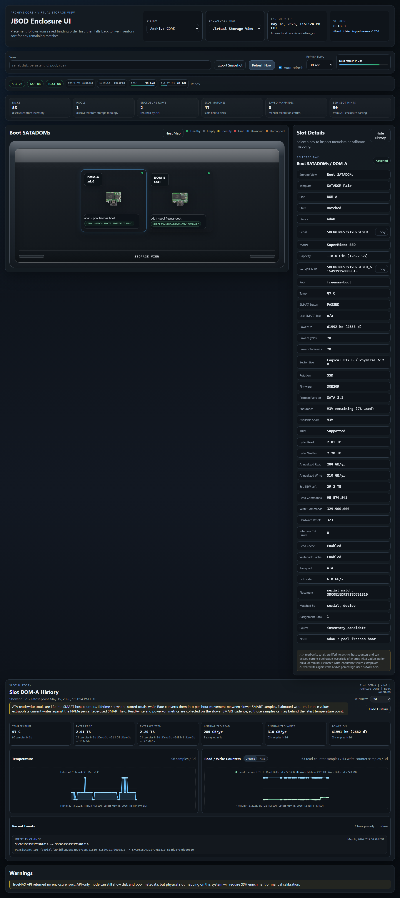
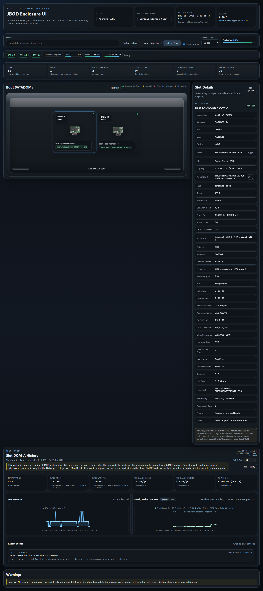
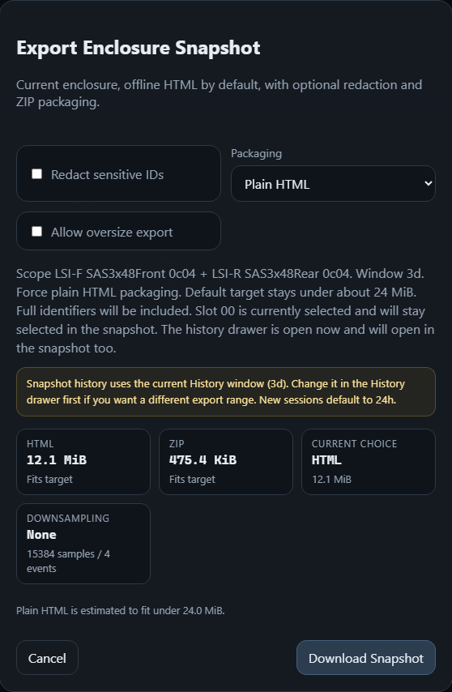
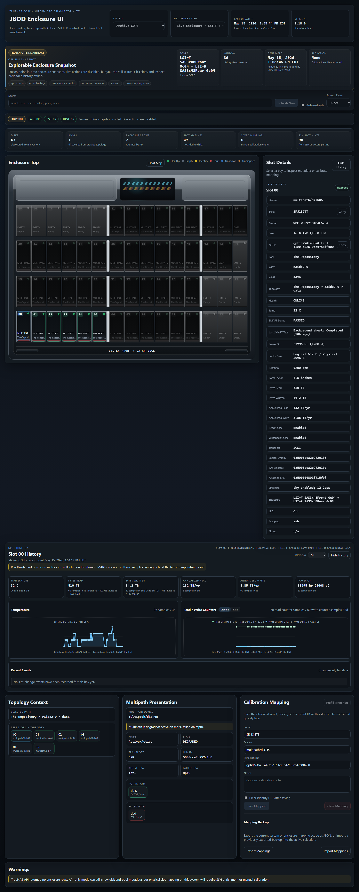

# History and Snapshot Export

This page is the visual guide for the optional history sidecar and the offline
snapshot export flow.

Use it when you want historical charts, timeline-backed heat maps, or one
self-contained offline HTML view of an enclosure. If you are trying to choose
between snapshot export, debug bundles, full backups, and the public demo, start
with
[[Demo and Offline Workflows|Demo-and-Offline-Workflows]].

## What This Adds

When the optional history sidecar is running, the main UI can:

- show a `History` button in Slot Details
- open a wide slot-history drawer under the enclosure
- render temperature and read/write history in browser-local time
- provide sampled data for [[Heat Map Mode|Heat-Map-Mode]] timelines and
  history-backed heat-map metrics
- export a frozen offline HTML snapshot of the current enclosure

The history sidecar is optional, but it is a normal supported runtime service,
not a dev-only helper. If it is unavailable, the live app keeps working and
snapshot exports still work, but they omit historical samples and events.

## Start The Optional History Sidecar

Use the same folder you created in [[Quick Start|Quick-Start]], where
`compose.yaml` and `.env` live:

```bash
docker compose --profile history pull
docker compose --profile history up -d
```

That keeps the main UI on `:8080` and starts the small history collector/API
sidecar on `127.0.0.1:8081`.

By default it also keeps:

- the live SQLite DB at `./history/history.db`
- short-term rotating backups at `./history/backups`
- weekly and monthly promoted long-term backups at
  `./history/backups/long-term`

If you later mount a separate disk or NFS path for longer-lived copies, point
`HISTORY_LONG_TERM_BACKUP_DIR` there and keep the short-term local path in
place.

## History Sidecar Dashboard

Open the history sidecar directly when you want to see what the collector is
doing:

```text
http://your-docker-host:8081
```

The dashboard now updates without a browser refresh:

- the collector status block follows cheap `/healthz` polling
- count cards, DB size, and tracked scopes follow the overview poll
- `Refresh Fast` runs the cached-root-only path for the current root scope
- `Refresh Full` runs the slower forced-inventory path and records stage
  timings so you can see where the time went

On a cold cache, a fast refresh may record a bounded `smart.failed` stage after
roughly five seconds. That means the cached SMART batch was unavailable or
slow; it should not set `last_error` or leave the collector stuck.

## What The Live History Drawer Looks Like

Once the sidecar is healthy, pick a populated slot and use the `History`
button in Slot Details.



Things to notice:

- the drawer opens under the enclosure instead of stretching the right detail rail
- the window picker applies to the whole history pane
- the read/write chart supports both total and average views
- recent events stay in the same place as you move between slots

The same history drawer is also available for inventory-bound
storage views such as `Boot SATADOMs` and the internal NVMe carrier:



Things to notice:

- disk-oriented metrics can now auto-follow the same physical disk across
  homes when the sidecar has a strong disk identity for it
- slot-change events still stay local to the slot you opened, so the drawer
  does not lie about where a swap or move happened
- if you are renaming or deleting whole systems, use
  [[History Maintenance and Recovery|History-Maintenance-and-Recovery]] for the
  cleanup/adoption tools instead of trying to hand-edit the SQLite DB

## Heat Map Timelines

Heat map mode has its own feature guide now:
[[Heat Map Mode|Heat-Map-Mode]].

The short version: history-backed heat-map metrics can switch from `Current`
to `Timeline`, start on the newest available sample, and scrub backward through
the selected window. After clicking the sample slider, use the left and right
arrow keys for fine one-sample steps.

## What The Snapshot Export Dialog Looks Like

Use `Export Snapshot` from the main toolbar.



Things to notice:

- live size estimates for `HTML`, `ZIP`, and the current choice
- redaction and packaging controls before download
- a clear note that snapshot history uses the current History drawer window
- downsampling feedback if larger exports need rollups later
- packaging changes reuse the estimate already on screen instead of
  recalculating the whole export payload

If you want a different snapshot history range, change the window in the
History drawer first, then open the export dialog.

## What The Offline Snapshot Looks Like

The export produces a self-contained HTML file that opens locally without
access to the live app.



Things to notice:

- the `Frozen Offline Artifact` banner makes it clear this is not the live UI
- the selected slot can stay selected in the snapshot
- the history drawer can stay open if it was open when exported
- live actions stay disabled, but slot inspection and navigation still work

## Snapshot Export Versus Admin Debug Bundle

These are intentionally different tools:

- `Export Snapshot` in the main UI creates one self-contained offline HTML
  artifact for the currently selected enclosure or storage view
- `Debug Bundle` in the admin sidecar on `:8082` creates a normal archive with
  selected config/history/support files for offline troubleshooting
- `Full Backup` in the admin sidecar creates the restore-grade bundle you use
  for import or cross-host recovery
- the [[Public Demo Site|Public-Demo-Site]] is a static sample data
  experience, not a backup/restore path and not a live hosted backend

Use the debug bundle when you want to hand someone a frozen stack state to
inspect. Use full backup when you actually need to restore the app later.

The debug bundle is not a standalone HTML viewer and it is not an import path
today. It does, however, support separate `Scrub obvious secrets` and `Scrub
disk identifiers` toggles so you can choose how much local detail to share.

The full backup/debug-bundle details live in
[[Backup, Restore, and Debug Bundles|Backup-Restore-and-Debug-Bundles]].

## Advanced Source Builds

Most users should use the published-image commands above. Use the source-build
command only when you are editing the app, testing an unmerged branch, or
intentionally rebuilding the image on that machine.

From a cloned repo:

```bash
docker compose -f docker-compose.dev.yml --profile history up -d --build
```

## If History Is Unavailable

The app should degrade like this:

- the `History` button stays hidden
- the export dialog warns that history will be omitted
- snapshot estimate and export still work
- the exported snapshot opens without historical charts or events

## Related Pages

- [[Visual Tour|Visual-Tour]]
- [[Heat Map Mode|Heat-Map-Mode]]
- [[Demo and Offline Workflows|Demo-and-Offline-Workflows]]
- [[Backup, Restore, and Debug Bundles|Backup-Restore-and-Debug-Bundles]]
- [[History Maintenance and Recovery|History-Maintenance-and-Recovery]]
