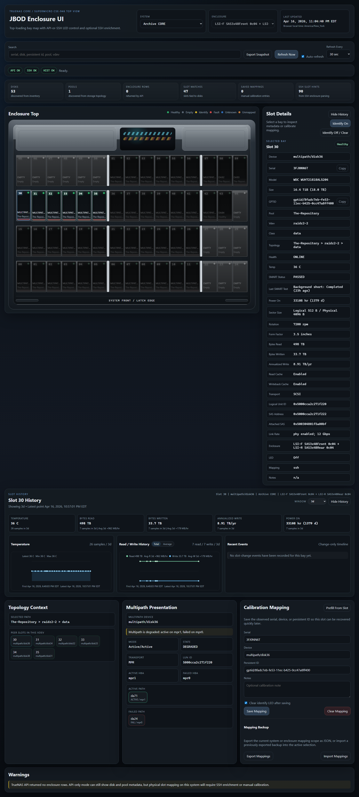
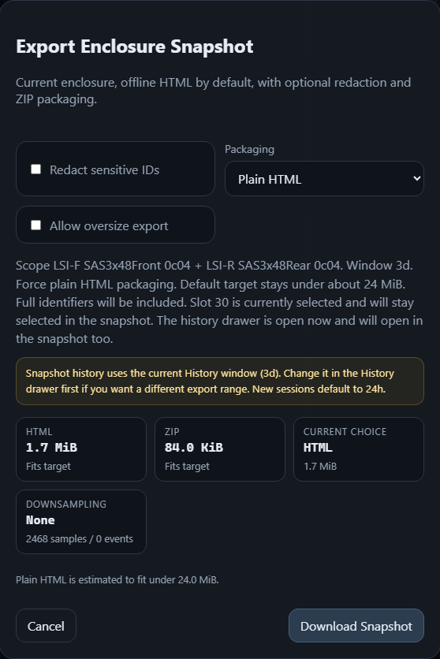
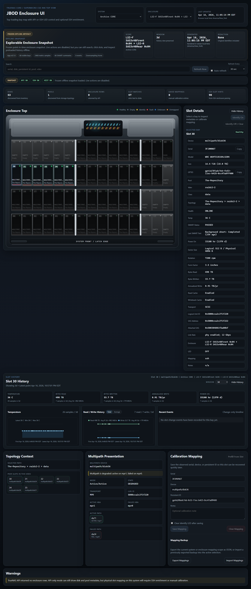

# History and Snapshot Export

This page is the visual guide for the optional history sidecar and the offline
snapshot export flow.

## What This Adds

When the optional history sidecar is running, the main UI can:

- show a `History` button in Slot Details
- open a wide slot-history drawer under the enclosure
- render temperature and read/write history in browser-local time
- export a frozen offline HTML snapshot of the current enclosure

The history sidecar is optional. If it is unavailable, the live app keeps
working and snapshot exports still work, but they omit historical samples and
events.

## Start The Optional History Sidecar

From the repo root:

```bash
docker compose --profile history up -d --build
```

That keeps the main UI on `:8080` and starts the small history collector/API
sidecar on `127.0.0.1:8081`.

By default it also keeps:

- the live SQLite DB at `./history/history.db`
- short-term rotating backups at `./history/backups`
- weekly and monthly promoted long-term backups at
  `./history/backups/long-term`

If you later mount a separate disk or NFS path for longer-lived copies, point
`HISTORY_LONG_TERM_BACKUP_DIR` there and keep the short-term local path in
place.

## What The Live History Drawer Looks Like

Once the sidecar is healthy, pick a populated slot and use the `History`
button in Slot Details.



Things to notice:

- the drawer opens under the enclosure instead of stretching the right detail rail
- the window picker applies to the whole history pane
- the read/write chart supports both total and average views
- recent events stay in the same place as you move between slots

## What The Snapshot Export Dialog Looks Like

Use `Export Snapshot` from the main toolbar.



Things to notice:

- live size estimates for `HTML`, `ZIP`, and the current choice
- redaction and packaging controls before download
- a clear note that snapshot history uses the current History drawer window
- downsampling feedback if larger exports need rollups later

If you want a different snapshot history range, change the window in the
History drawer first, then open the export dialog.

## What The Offline Snapshot Looks Like

The export produces a self-contained HTML file that opens locally without
access to the live app.



Things to notice:

- the `Frozen Offline Artifact` banner makes it clear this is not the live UI
- the selected slot can stay selected in the snapshot
- the history drawer can stay open if it was open when exported
- live actions stay disabled, but slot inspection and navigation still work

## If History Is Unavailable

The app should degrade like this:

- the `History` button stays hidden
- the export dialog warns that history will be omitted
- snapshot estimate and export still work
- the exported snapshot opens without historical charts or events
