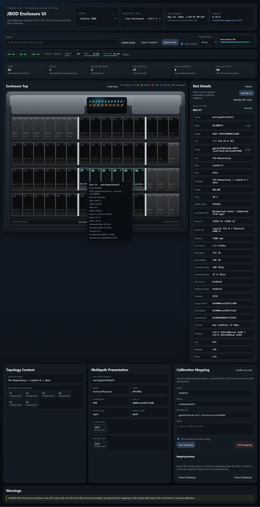

# JBOD Enclosure UI Wiki

This wiki is the practical guide for running and tuning the project.

The goal is simple:

- let a homelabber get the app running with copy-paste steps
- let an intermediate user enable richer SSH-based mapping and SMART detail
- let an advanced user tune profiles, command sets, and multi-system layouts

If you are new here, use this order:

1. [[Visual Tour|Visual-Tour]] if you want to see what the app looks like
2. [[Quick Start|Quick-Start]] to install with Docker Compose and published
   images
3. [[TrueNAS CORE Setup|TrueNAS-CORE-Setup]] or
   [[TrueNAS SCALE Setup|TrueNAS-SCALE-Setup]] for the host-side bits
4. [[Troubleshooting]] if the page loads but the disks, slots, or history do
   not look right yet

If you already know what kind of host you are targeting, jump to:

- [[TrueNAS CORE Setup|TrueNAS-CORE-Setup]]
- [[TrueNAS SCALE Setup|TrueNAS-SCALE-Setup]]
- [[Quantastor Setup|Quantastor-Setup]]
- [[Generic Linux Setup|Generic-Linux-Setup]]

If you want to control what the enclosure looks like, use:

- [[Profiles and Custom Layouts|Profiles-and-Custom-Layouts]]
- [[Live Enclosures and Storage Views|Live-Enclosures-and-Storage-Views]]

If you want operator feature guides, use:

- [[Heat Map Mode|Heat-Map-Mode]]
- [[History and Snapshot Export|History-and-Snapshot-Export]]
- [[Admin UI and System Setup|Admin-UI-and-System-Setup]]
- [[Demo and Offline Workflows|Demo-and-Offline-Workflows]]
- [[Public Demo Site|Public-Demo-Site]] for the planned GitHub Pages demo
  boundary
- [[History Maintenance and Recovery|History-Maintenance-and-Recovery]]

If you want deeper runtime and tuning detail, use:

- [[Backup, Restore, and Debug Bundles|Backup-Restore-and-Debug-Bundles]]
- [[Operations, Logging, and Metrics|Operations-Logging-and-Metrics]]
- [[Docker and GHCR Deployment|Docker-and-GHCR-Deployment]]
- [[Architecture and Services|Architecture-and-Services]]
- [[Advanced Configuration|Advanced-Configuration]]
- [[SSH Setup and Sudo|SSH-Setup-and-Sudo]]

If something is wrong, use:

- [[Troubleshooting]]

If you are maintaining the GitHub wiki itself, use:

- [[Publishing the Wiki|Publishing-the-Wiki]]

## What This App Does

The app runs off-box in Docker. For the normal homelab path, it talks to
TrueNAS CORE or SCALE, maps the storage host into a physical bay view, and lets
you inspect disks without logging into the NAS every time.

The main UI is read-oriented and runs on `:8080`. Optional sidecars can add:

- history collection and offline snapshot export on `:8081`
- setup, backup/restore, profile building, and runtime maintenance on `:8082`

Less common targets such as Quantastor, generic Linux, UniFi, IPMI/BMC, and
ESXi are supported through their own setup pages, but they do not need to be in
the first-run path for a TrueNAS box.

It gives you:

- a physical slot map
- per-slot disk detail
- pool and vdev context
- identify LED control where supported
- manual slot calibration
- multi-system selection
- profile-driven enclosure layouts
- heat-map overlays for temperature, activity, endurance, risk, and other
  numeric metrics
- published-image Docker Compose install and update commands
- optional history, admin, backup, restore, and debug workflows once the main
  read view is working

## Current Validated Hardware

TrueNAS CORE and SCALE are the main audience. The broader lab coverage below
shows what has been exercised so far; platform-specific pages carry the deeper
setup notes.

- TrueNAS CORE on a Supermicro CSE-946 style `60`-bay top-loading shelf
- TrueNAS SCALE on a Supermicro `SSG-6048R-E1CR36L` with front `24` and rear `12`
- OSNexus Quantastor on a Supermicro `SSG-2028R-DE2CR24L` shared front `24`
- Generic Linux on a Supermicro `SYS-2029GP-TR` with a right-side `2`-bay NVMe profile
- Supermicro FatTwin `SYS-F629P3-RC1B` nodes through the built-in `ipmi`
  platform with a validated front `6`-bay view, inferred rear `2`-bay view,
  Broadcom storage monitoring, and BMC-backed slot identify
- VMware ESXi `7.0.3` on that same FatTwin / Broadcom 3108 path, using BMC
  slot truth plus SSH `esxcli` / StorCLI enrichment for a read-only front
  `6`-bay JBOD-member view
- VMware ESXi `7.0.3` on a Supermicro `AOC-SLG4-2H8M2`, using SSH `esxcli`
  plus StorCLI for a read-only `2`-slot M.2 RAID-member view
- UniFi UNVR as generic Linux over SSH with a built-in `4`-bay profile and
  validated vendor-local LED control
- UniFi UNVR Pro as generic Linux over SSH with a built-in `7`-bay `3-over-4`
  profile and experimental vendor-local LED control

## Current Version

`0.18.0` is the current stable release. Its headline feature is read-only
[[Heat Map Mode|Heat-Map-Mode]], including history-backed timeline scrubbing
for supported metrics.

The next planning slice is the public demo idea: a static GitHub Pages sample
data experience, not a hosted copy of the live Docker app. See
[[Public Demo Site|Public-Demo-Site]].

For older release-by-release detail, use the project changelog and GitHub
releases instead of treating the wiki home page as release notes.

## Visual Walkthrough

If you learn better by seeing the flow first, start here:

- [[Visual Tour|Visual-Tour]]
- [[History and Snapshot Export|History-and-Snapshot-Export]]
- [[Heat Map Mode|Heat-Map-Mode]]
- [[Public Demo Site|Public-Demo-Site]]

Those pages show:

- the live history drawer on a populated slot
- heat-map overlays for the physical bay layout
- the export snapshot dialog with live size estimates
- the frozen offline snapshot HTML after export
- the planned boundary for a future static public demo
- the maintenance/recovery follow-up lives on
  [[History Maintenance and Recovery|History-Maintenance-and-Recovery]]

## Page Map

The wiki is organized so the top of each page gives the practical answer first,
then deeper details below it.

| Need | Pages |
| --- | --- |
| First install | [[Quick Start|Quick-Start]], [[Visual Tour|Visual-Tour]], [[TrueNAS CORE Setup|TrueNAS-CORE-Setup]], [[TrueNAS SCALE Setup|TrueNAS-SCALE-Setup]] |
| Fix the common stuff | [[Troubleshooting]], [[SSH Setup and Sudo|SSH-Setup-and-Sudo]] |
| Day-to-day features | [[Live Enclosures and Storage Views|Live-Enclosures-and-Storage-Views]], [[Heat Map Mode|Heat-Map-Mode]], [[History and Snapshot Export|History-and-Snapshot-Export]] |
| Admin and safety | [[Admin UI and System Setup|Admin-UI-and-System-Setup]], [[Backup, Restore, and Debug Bundles|Backup-Restore-and-Debug-Bundles]], [[History Maintenance and Recovery|History-Maintenance-and-Recovery]] |
| Less common platforms | [[Quantastor Setup|Quantastor-Setup]], [[Generic Linux Setup|Generic-Linux-Setup]] |
| Deeper operations | [[Docker and GHCR Deployment|Docker-and-GHCR-Deployment]], [[Operations, Logging, and Metrics|Operations-Logging-and-Metrics]], [[Architecture and Services|Architecture-and-Services]], [[Advanced Configuration|Advanced-Configuration]] |
| Demo and offline boundaries | [[Demo and Offline Workflows|Demo-and-Offline-Workflows]], [[Public Demo Site|Public-Demo-Site]] |
