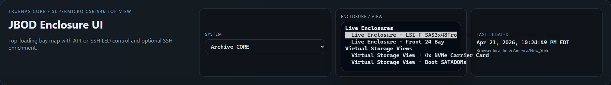
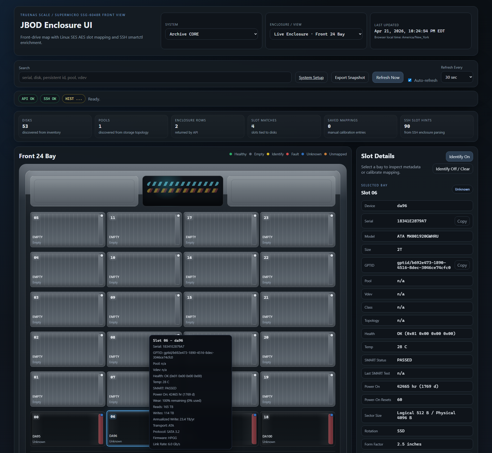

# Live Enclosures and Storage Views

This page is the quick mental model for what the selector is showing.

## Current Runtime Example

The current `archive-core` runtime selector shows the live and virtual groups
that are actually configured today:

`archive-core` intentionally does not keep a duplicate saved chassis view by
default, so the `Saved Chassis Views` runtime group only appears after an
operator deliberately adds one.

## The Three Runtime Categories

- `Live Enclosure`
  - a real chassis or backplane discovered at runtime from the host API and/or
    SSH SES data
  - examples: a CORE `60`-bay shelf, a discovered front `24`-bay enclosure, a
    rear `12`-bay enclosure on SCALE
- `Saved Chassis View`
  - a saved overlay that mirrors a live enclosure through a chosen profile or
    layout
  - useful when you want a curated presentation of real bays without replacing
    the discovered hardware view itself
- `Virtual Storage View`
  - a saved internal group that binds real disks into a layout that is not a
    live SES enclosure
  - examples: `4x NVMe Carrier Card`, `Boot SATADOMs`
  - on Quantastor HA installs, a virtual view can also pin a target HA node
    so left/right SATADOM groups or other internal layouts resolve against the
    intended shared-SES member cleanly

## What Auto-Populates

Live discovered enclosures auto-populate on their own.

That means:

- if the host exposes a real enclosure through the API, SSH SES, or both, it
  should show up as a `Live Enclosure`
- you do not need to create a saved storage view just to make real hardware
  appear

## What The Admin Sidecar Saves

The admin sidecar saves config-backed views and bindings.

It is the right place to create:

- a saved chassis layout for a live enclosure
- an internal NVMe carrier layout
- a SATADOM or boot-device group
- a manual internal grouping for odd fixed disks

It does not create new live hardware.

The admin sidecar uses one `Add Storage View` flow for both saved chassis
layouts and virtual/internal templates. For `ses_enclosure` views, the saved
view now carries its own `profile_id`, so a `Generic Front 24` or other common
layout can stay pinned even when the active live enclosure is using a
different profile.

Here is the current admin-side grouped picker and profile catalog:

## Profiles Vs Storage Views

Profiles and storage views solve different problems:

- a `profile` defines how a chassis should look
- a `live enclosure` decides what hardware was actually discovered
- a `saved chassis view` lets you mirror discovered hardware through a saved
  profile-backed layout
- a `virtual storage view` lets you group disks that do not come from a real
  enclosure backplane

## Practical Example

For a TrueNAS CORE host with:

- one live `60`-bay top-loading shelf
- one live `24`-bay brain chassis discovered from SSH SES
- one internal `4x NVMe Carrier Card`
- one `Boot SATADOMs` pair

the selector can legitimately show all four, but they are not the same kind of
thing:

- the `60`-bay and `24`-bay entries are `Live Enclosures`
- the NVMe card and SATADOM pair are `Virtual Storage Views`

If you later add a saved mirrored `Front Bays` or `Primary Chassis` view, that
becomes a `Saved Chassis View`, not a second physical shelf.

The separate `Front 24 Bay` live enclosure now also shows up as its own
runtime target on `archive-core`:

