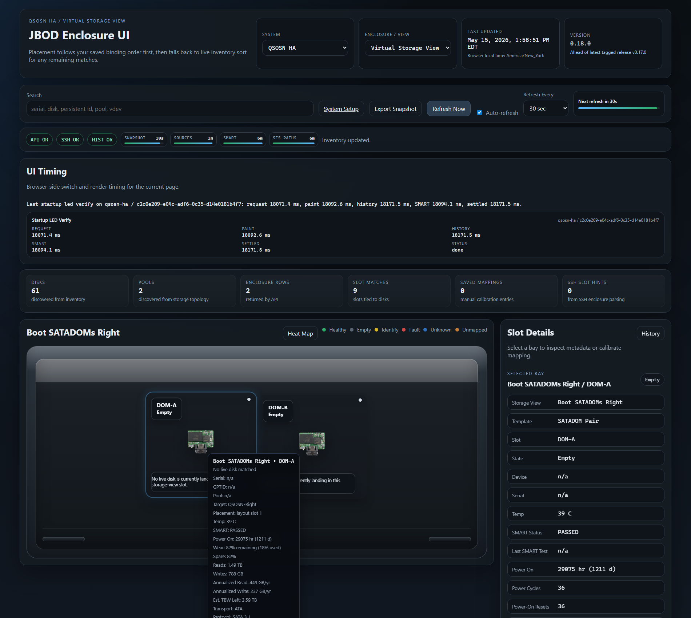

# Quantastor Setup

This page is the practical setup path for the current Quantastor support.

Validated target so far:

- OSNexus Quantastor on a Supermicro `SSG-2028R-DE2CR24L`
- shared front `24`-slot face
- one saved cluster entry with a shared API/grid-management host
- up to three HA nodes that can share the same SES disks
- REST-first inventory with optional SSH, `qs`, `smartctl`, and `sg_ses`
  enrichment

## What Works Today

- shared-face live enclosure rendering
- per-slot detail with:
  - `Presented By`
  - `Pool Active On`
  - `I/O Fence On`
  - `Visible On`
  - `SES Host`
- one Quantastor system entry can now carry up to three HA nodes
- inventory-bound storage views can target a specific HA node cleanly
- SATADOM or other internal views can be split per node instead of pretending
  the whole appliance is one monolithic host
- admin can discover node ids and labels from the Quantastor API
- disk metrics and history work on both the shared face and storage views

Here is an example Quantastor HA SATADOM view in the main UI:



## Recommended Admin Flow

The admin sidecar is the easiest path now, and it is a normal supported
runtime service rather than a dev-only helper.

1. Start the admin sidecar:

   ```bash
   docker compose --profile admin up -d enclosure-admin
   ```

   Or, if you are intentionally building from source:

   ```bash
   docker compose -f docker-compose.dev.yml --profile admin up -d --build enclosure-admin
   ```

2. Create one Quantastor system entry:
   - system label: `ExampleQS HA`
   - system id: `example-qs-ha`
   - platform: `Quantastor`
   - `truenas.host`: point this at the shared API or management VIP
3. In SSH enrichment:
   - enable SSH if you want `qs`, `smartctl`, or `sg_ses` detail
   - turn on the Quantastor HA cluster checkbox
   - use `Load Nodes from Quantastor API` to populate the node ids, labels, and
     any API-advertised node hostnames/IPs
   - keep the shared API or grid-management VIP out of SSH targeting
   - the app auto-adds HA node SSH candidates from API `hostname`, main IP,
     management IP, or other node address fields when Quantastor exposes them
   - if the appliance only returns ids and labels, fill the per-node SSH host
     fields manually before expecting `qs`, `smartctl`, SES, or SATADOM access
     to run
4. Ignore management-only helper VMs here. If a helper VM is not one of the
   shared-SES HA nodes, do not model it as one.
5. Add only the saved views you actually need:
   - optional saved `Primary Chassis` if you want a pinned profile-backed
     shared-front layout
   - `Boot SATADOMs Left` targeted at `ExampleQS-Left`
   - `Boot SATADOMs Right` targeted at `ExampleQS-Right`
6. Save, then verify in the main UI:
   - the shared front live enclosure should still auto-populate
   - SATADOM views should render as `Virtual Storage View` targets
   - slot detail should show the HA context rows above

## Equivalent YAML Shape

If you prefer to understand the saved config shape directly, it now looks more
like this:

```yaml
- id: example-qs-ha
  label: ExampleQS HA
  default_profile_id: supermicro-ssg-2028r-shared-front-24
  truenas:
    host: https://quantastor.example.test
    api_user: jbodmap
    api_password: replace_me
    platform: quantastor
    verify_ssl: true
    timeout_seconds: 15
  ssh:
    enabled: true
    host: 192.0.2.30  # optional legacy/default node fallback; not the API VIP
    ha_enabled: true
    ha_nodes:
      - system_id: 11111111-1111-4111-8111-111111111111
        label: ExampleQS-Left
        host: 192.0.2.30  # recommended for node-targeted SSH
      - system_id: 22222222-2222-4222-8222-222222222222
        label: ExampleQS-Right
        host: 192.0.2.31  # recommended for node-targeted SSH
    port: 22
    user: jbodmap
    key_path: /run/ssh/id_jbodmap
    known_hosts_path: /app/data/known_hosts
    strict_host_key_checking: false
    timeout_seconds: 15
    commands: []
  storage_views:
    - id: primary-chassis
      label: Primary Chassis
      kind: ses_enclosure
      template_id: ses-auto
      profile_id: supermicro-ssg-2028r-shared-front-24
      enabled: true
    - id: boot-satadoms-left
      label: Boot SATADOMs Left
      kind: boot_devices
      template_id: satadom-pair-2
      enabled: true
      binding:
        mode: hybrid
        target_system_id: 11111111-1111-4111-8111-111111111111
        serials:
          - SMC0515D92721DUK2088
          - SMC0515D92721DUK4173
    - id: boot-satadoms-right
      label: Boot SATADOMs Right
      kind: boot_devices
      template_id: satadom-pair-2
      enabled: true
      binding:
        mode: hybrid
        target_system_id: 22222222-2222-4222-8222-222222222222
        serials:
          - SMC0515D92721DUJ6071
          - SMC0515D92721DUK3185
```

Notes:

- `truenas.host` should point at the shared API or management VIP
- `ssh.host` is only a legacy/default node fallback; do not point it at the
  shared API or grid-management VIP for HA systems
- `ssh.ha_nodes[*].host` is an override/fallback SSH target list for HA systems
  when the appliance does not expose usable node hostnames/IPs
- Quantastor SSH enrichment auto-discovers all hardware-backed HA nodes with
  usable API-advertised hostnames/IPs. Once one real node is reachable, it also
  reads `qs network-port-list` and prefers the per-node interface with a
  configured default gateway, filters out the shared API endpoint, and can
  prefer the active pool-owner node for pool-related SMART/CLI follow-up
- `ssh.commands` usually stays blank for Quantastor unless you have a custom
  reason to override the platform-owned defaults
- `binding.target_system_id` is what pins a storage view to one HA node

## Prepare The SSH User

The app works best when the SSH user has:

- a real home directory
- a real login shell
- a `~/.qs.cnf` file for local `qs` console authentication

Typical sanity checks:

```bash
sudo -u jbodmap -H bash -lc 'whoami && hostname && echo $HOME && which qs'
sudo -u jbodmap -H bash -lc 'cat ~/.qs.cnf'
```

Expected shape:

- the user prints as `jbodmap`
- `which qs` returns `/usr/bin/qs`
- `~/.qs.cnf` exists for local CLI auth

## Add The Useful `sudoers` Rules

The app does not need blanket root, but Quantastor is much more useful when the
SSH user can run `smartctl` and `sg_ses` without a password.

SMART:

```bash
sudo tee /etc/sudoers.d/jbodmap-smartctl >/dev/null <<'EOF'
Defaults:jbodmap !requiretty
jbodmap ALL=(root) NOPASSWD: /usr/sbin/smartctl -x -j /dev/sd*
jbodmap ALL=(root) NOPASSWD: /usr/sbin/smartctl -x /dev/sd*
jbodmap ALL=(root) NOPASSWD: /usr/sbin/smartctl -x -j /dev/disk/by-id/scsi-*
jbodmap ALL=(root) NOPASSWD: /usr/sbin/smartctl -x /dev/disk/by-id/scsi-*
EOF

sudo chmod 440 /etc/sudoers.d/jbodmap-smartctl
sudo visudo -cf /etc/sudoers.d/jbodmap-smartctl
```

SES and identify LEDs:

```bash
sudo tee /etc/sudoers.d/jbodmap-sg_ses >/dev/null <<'EOF'
Defaults:jbodmap !requiretty
jbodmap ALL=(root) NOPASSWD: /usr/bin/sg_ses -p aes /dev/sg*
jbodmap ALL=(root) NOPASSWD: /usr/bin/sg_ses -p ec /dev/sg*
jbodmap ALL=(root) NOPASSWD: /usr/bin/sg_ses --dev-slot-num=* --set=ident /dev/sg*
jbodmap ALL=(root) NOPASSWD: /usr/bin/sg_ses --dev-slot-num=* --clear=ident /dev/sg*
EOF

sudo chmod 440 /etc/sudoers.d/jbodmap-sg_ses
sudo visudo -cf /etc/sudoers.d/jbodmap-sg_ses
```

## Sanity-Check The Node Capabilities

CLI:

```bash
sudo -u jbodmap -H bash -lc 'qs disk-list --json | head'
sudo -u jbodmap -H bash -lc 'qs hw-disk-list --json | head'
sudo -u jbodmap -H bash -lc 'qs hw-enclosure-list --json | head'
```

SMART:

```bash
sudo -u jbodmap -H bash -lc 'sudo -n /usr/sbin/smartctl -x /dev/sdf | head -40'
```

SES:

```bash
sudo -u jbodmap -H bash -lc 'sudo -n /usr/bin/sg_ses -p aes /dev/sg11 | head -60'
sudo -u jbodmap -H bash -lc 'sudo -n /usr/bin/sg_ses -p ec /dev/sg11 | head -60'
```

If one node only shows the working SES path, keep that host configured in the
HA-node rows so the app can target it cleanly for LEDs or extra enclosure
detail.

## Known Limits

- Quantastor support is still intentionally practical rather than pretending
  the whole appliance is a perfectly abstracted universal enclosure
- the documented REST and `qs` identify methods are still failing on the
  validated LSI path, so the app prefers `sg_ses`
- node discovery currently gives ids and labels on this install, but not
  always hostnames, so node SSH hosts may still need manual entry
- the current validation is centered on one real shared-front `24`-bay HA
  cluster, not a broad hardware matrix

For deeper setup detail, use:

- [[Admin UI and System Setup|Admin-UI-and-System-Setup]]
- [[SSH Setup and Sudo|SSH-Setup-and-Sudo]]
- [[Troubleshooting]]
