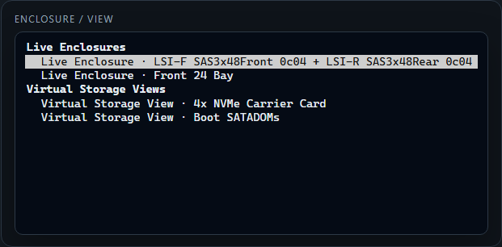

# Visual Tour

This page is the quickest way to recognize the main screens before reading the
deeper setup guides.

Use it when you want to answer:

- what does the main enclosure UI look like?
- where do storage views and heat maps show up?
- what do the optional history and admin sidecars add?
- what is the difference between a live page and an offline artifact?

For installation steps, start with [[Quick Start|Quick-Start]]. For the
container/service map, use
[[Architecture and Services|Architecture-and-Services]].

Screenshots on this page were refreshed from the `0.18.0` UI.

## Main Enclosure View

The primary screen is a physical slot map. The goal is to make the bay location
obvious first, then expose disk and topology detail when you inspect a slot.
For CORE, the main example is the 60-bay top-loading shelf because that is the
representative day-to-day chassis view.

## Runtime Selector

The selector groups runtime targets by what they are:

- `Live Enclosures` are physical targets discovered from a host.
- `Saved Chassis Views` are operator-created layout overlays, when configured.
- `Virtual Storage Views` are internal or logical disk groups such as boot
  devices or carrier cards.

## Heat Map Mode

Heat map mode keeps the physical enclosure shape and colors each bay by a
selected numeric metric such as temperature, read/write rate, endurance, or
attention score.

The details live in [[Heat Map Mode|Heat-Map-Mode]].

## History Drawer

When the optional history sidecar is running, populated slots can open a
history drawer under the enclosure. Storage views use the same drawer when the
selected internal disk has a stable identity.

The details live in
[[History and Snapshot Export|History-and-Snapshot-Export]].

## Admin Setup

The optional admin sidecar handles guided setup, system config, SSH material,
runtime controls, profile authoring, backup/restore tools, and maintenance
flows.

Use [[Admin UI and System Setup|Admin-UI-and-System-Setup]] for launch and
setup. Use
[[Backup, Restore, and Debug Bundles|Backup-Restore-and-Debug-Bundles]] for
backup, restore, debug bundles, and destructive-maintenance guardrails.

## Profile Builder

The builder workspace creates reusable custom enclosure profiles without
hand-editing `profiles.yaml` first.

The details live in
[[Profiles and Custom Layouts|Profiles-and-Custom-Layouts]].

## Snapshot Export

The main UI can export a self-contained offline HTML artifact for the current
enclosure or storage view.

The exported file opens away from the live app:

The boundaries between public demo, offline snapshot, debug bundle, and full
backup are summarized in
[[Demo and Offline Workflows|Demo-and-Offline-Workflows]].

## Maintenance Tools

History cleanup and adoption tools live in the admin sidecar because they can
rewrite local sidecar data.

Use [[History Maintenance and Recovery|History-Maintenance-and-Recovery]] for
the history-specific cleanup flow.

## Related Pages

- [[Quick Start|Quick-Start]]
- [[Architecture and Services|Architecture-and-Services]]
- [[Live Enclosures and Storage Views|Live-Enclosures-and-Storage-Views]]
- [[Heat Map Mode|Heat-Map-Mode]]
- [[History and Snapshot Export|History-and-Snapshot-Export]]
- [[Admin UI and System Setup|Admin-UI-and-System-Setup]]
